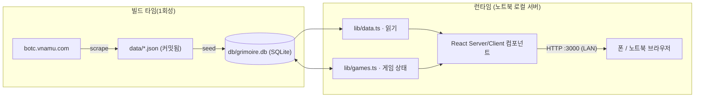
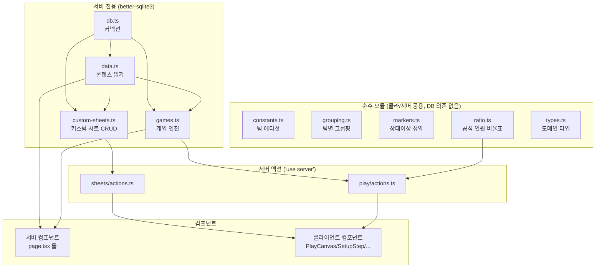
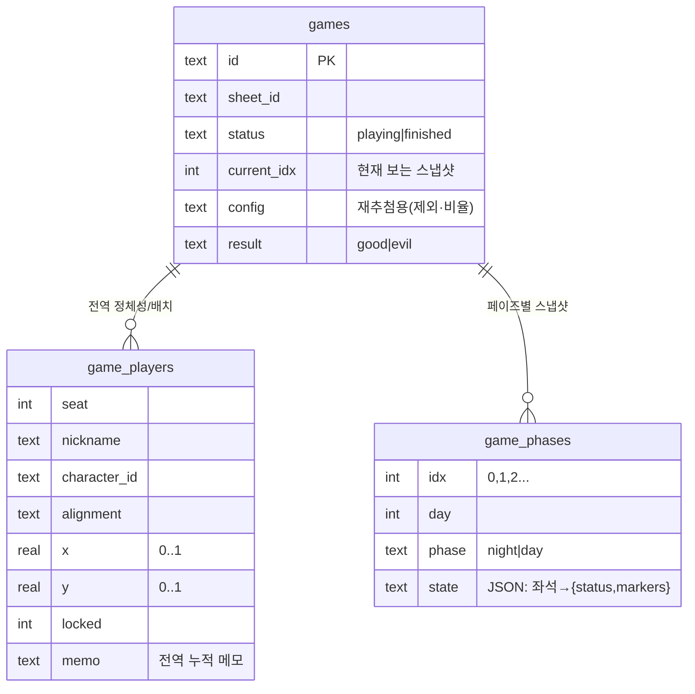
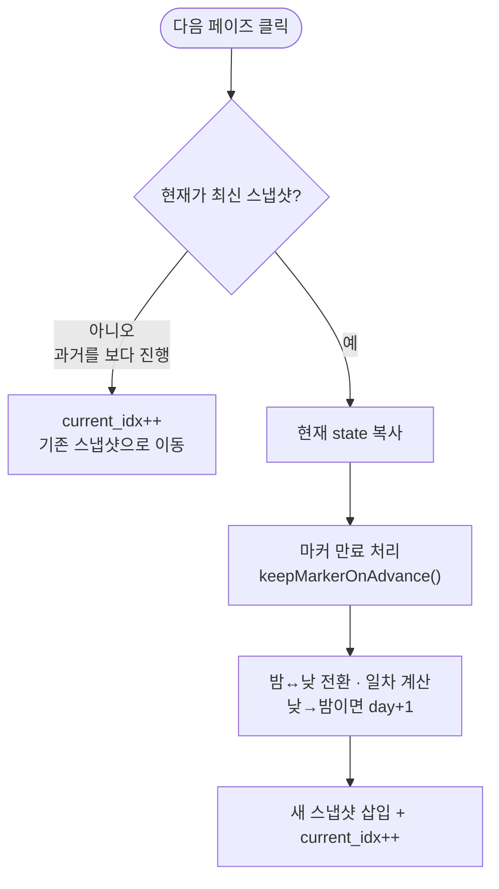
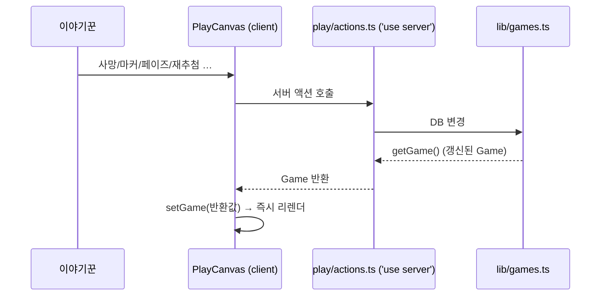

# BotC 그리모어 — DeepWiki

> 시계탑에 흐른 피(Blood on the Clocktower) 레퍼런스 + 로컬 디지털 그리모어.
> 이 문서는 코드를 처음 보는 사람이 **머릿속에 전체 그림을 그리고**, 어디를 고치면
> 무엇이 바뀌는지 알 수 있게 하는 것을 목표로 한다. 추상적인 미사여구 대신, 실제
> 파일과 데이터 흐름에 근거한다.

---

## 0. 30초 요약 (멘탈 모델)

세 가지만 기억하면 된다.

1. **콘텐츠(직업·시트·규칙)는 읽기 전용 데이터다.** `vnamu` 사이트에서 한 번 긁어
   `data/*.json`으로 박제하고, 빌드 전에 SQLite로 굽는다. 화면은 거의 정적이다.
2. **그리모어(게임 진행)는 가변 상태다.** SQLite에 게임을 저장한다. 핵심 아이디어
   하나: **"플레이어 정체성(누가 무슨 직업·어디 앉음)"은 게임 전역에 하나, "그 시점의
   상태(생사·효과)"는 페이즈마다 독립 스냅샷"** 으로 나눈다.
3. **노트북 한 대가 서버다.** `0.0.0.0`에 바인딩해서, 같은 WiFi의 폰이 붙는다.
   인터넷이 없어도 LAN에서 돈다(아이콘·데이터 전부 로컬).

---

## 1. 기술 스택과 그 이유

| 영역 | 선택 | 왜 |
|---|---|---|
| 프레임워크 | **Next.js 16** (App Router, Turbopack) | 한 프로세스로 정적 콘텐츠 + 서버 액션(가변 게임 상태)을 동시에. 로컬 Node 서버로 LAN 노출이 자연스러움 |
| UI | React 19 + TypeScript | — |
| 스타일 | Tailwind v4 | 설정 파일 없이 `@theme`로 토큰 정의 ([app/globals.css](app/globals.css)) |
| 저장소 | **better-sqlite3 12** (동기 API) | 로컬 단일 파일 DB. 동기라 서버 컴포넌트/액션에서 `await` 없이 즉시 질의 → SSG·SSR 모두 단순. [next.config.ts](next.config.ts)에서 `serverExternalPackages`로 번들 제외(네이티브 모듈) |

**LAN 구동**: [package.json](package.json)의 `dev`/`start`가 `next ... -H 0.0.0.0`.
폰은 `http://<노트북IP>:3000`으로 접속.

---

## 2. 데이터 파이프라인 (콘텐츠는 어떻게 들어오나)

콘텐츠는 "런타임에 가져오는 것"이 아니라 **빌드 전에 박제하는 것**이다. 3단계.

```mermaid
flowchart TD
  A["scripts/scrape-vnamu.mjs"] -->|"브라우저 UA로 403 우회"| B["botc.vnamu.com"]
  B -->|"루트 HTML: const JINXES + .char-card DOM"| A
  B -->|"/library/&#123;id&#125; 상세 183개"| A
  A -->|"이미지 다운로드"| I["public/icons/*.webp"]
  A --> J["data/characters.json · sheets.json"]
  Jr["data/rules.json (수기 관리)"] --> S
  J --> S["scripts/seed-db.mjs"]
  S --> DB[("db/grimoire.db")]
```

- **스크래핑** ([scripts/scrape-vnamu.mjs](scripts/scrape-vnamu.mjs)): vnamu는 일반 fetch에
  403을 주지만 브라우저 User-Agent를 붙이면 200. 루트 HTML에 `const JINXES = {...}`(징크스)와
  `.char-card`의 `data-*`(id·팀·이름·능력·아이콘 URL→에디션)가 임베드돼 있다. 상세 데이터
  (분위기글·상세설명·운영방식·야간 순서/리마인더)는 직업별 `/library/{id}` 183페이지에서
  `lang-sw` + `data-ko/data-en`로 추출. 공식 3시트는 아이콘 경로의 에디션 코드(tb/bmr/snv)로
  그룹핑해 도출.
- **시드** ([scripts/seed-db.mjs](scripts/seed-db.mjs)): `data/*.json` → SQLite 콘텐츠 테이블.
  `predev`/`prebuild`로 자동 실행되므로 `db/grimoire.db`는 **재생성 가능 → gitignore** 대상.
  소스 오브 트루스는 사람이 읽고 고칠 수 있는 `data/*.json`(커밋됨).

> **왜 JSON을 시드로 남기나?** SQLite를 직접 편집하면 diff가 안 보이고 재현이 어렵다.
> JSON을 두면 데이터 변경이 git diff로 보이고, `npm run db:seed`로 언제든 똑같이 복원된다.

데이터 규모: 직업 **183종**(공식+실험판+팬 "로릭"), 팀 7종(마을주민·외부인·하수인·악마·여행자·전설·로릭),
에디션 5종(tb/bmr/snv/loric/other). 한·영 병기.

---

## 3. 코드 지도 (레이어)

**경계 규칙**: `better-sqlite3`를 import하는 모듈(db/data/custom-sheets/games)은 **서버 전용**.
클라이언트 컴포넌트가 실수로 import하면 빌드가 깨진다(의도된 가드). 그래서 클라에서 쓰는
유틸은 전부 순수 모듈(constants/grouping/markers/ratio/types)로 분리돼 있다.

---

## 4. 라우트 맵

| 경로 | 종류 | 설명 |
|---|---|---|
| `/` | 정적 | 직업 목록 + 필터/검색 ([CharacterBrowser](components/CharacterBrowser.tsx)) |
| `/characters/[id]` | SSG (183) | 직업 상세 + 한/영 토글 ([CharacterDetail](components/CharacterDetail.tsx)) |
| `/sheets` | 동적 | 공식 + 커스텀 시트 목록 |
| `/sheets/[id]` | SSG+동적 | 시트 상세 + 야간순서표 + `시작하기` |
| `/sheets/new`, `/sheets/[id]/edit` | 정적/동적 | 커스텀 시트 생성·수정 ([SheetBuilder](components/SheetBuilder.tsx)) |
| `/rules` | 정적 | 규칙 + 목차 |
| `/games` | 동적 | 진행/종료 게임 목록 |
| `/play/setup/[sheetId]` | 동적 | **준비 스텝** ([SetupStep](components/SetupStep.tsx)) |
| `/play/[gameId]` | 동적 | **진행 스텝**(PlayCanvas) 또는 **복기**(GameReplay) |

콘텐츠는 정적/SSG(빌드 시 SQLite 읽음), 게임/커스텀시트는 `force-dynamic`(가변).

---

## 5. 그리모어 엔진 (이 프로젝트의 심장)

전부 [lib/games.ts](lib/games.ts)에 있다. 여기만 이해하면 게임 로직의 90%를 안다.

### 5.1 핵심 아이디어: 정체성 ↔ 페이즈 스냅샷 분리

물리 그리모어를 떠올리자. **자리 배치와 누가 무슨 직업인지**는 게임 내내 거의 안 바뀐다.
반면 **누가 죽었고 무슨 효과를 받았는지**는 매 페이즈(밤/낮)마다 바뀐다. 이 둘을 한 덩어리로
저장하면 "어젯밤 상태로 되돌리기"가 불가능하다. 그래서 분리한다.

- **`game_players`** = 전역. 좌석·닉네임·직업·진영·캔버스 위치(0~1 비율)·고정·메모.
  페이즈와 무관. 위치를 옮기면 모든 페이즈에서 같은 자리.
- **`game_phases`** = 페이즈별 독립 스냅샷. `state`는 `{ [seat]: {status, markers[]} }` JSON.
  `games.current_idx`가 지금 보는 스냅샷을 가리킨다.

`getGame()`은 이 둘을 합쳐 `Game`(전역 + 현재 스냅샷 상태)을 돌려준다. 화면은 항상 한 장의
일관된 보드로 보이지만, 실제로는 "현재 인덱스 스냅샷"을 그리는 것이다.

### 5.2 페이즈 진행 — 다이어그램

핵심: **과거 페이즈로 갔다가 다시 진행하면 새로 만들지 않고 기존 스냅샷으로 포인터만 옮긴다.**
과거 스냅샷을 수정해도 다른 페이즈에 전파(cascade)되지 않는다 — 각 페이즈는 독립 데이터셋.
이게 "복기"와 "되돌려서 고치기"를 동시에 가능하게 한다.

### 5.3 상태이상(마커)와 지속시간 — [lib/markers.ts](lib/markers.ts)

마커는 `"base"` 또는 `"base:param"` 문자열로 저장. 지속(`duration`)이 만료 규칙을 정한다.

| duration | 소멸 시점 | 예 |
|---|---|---|
| `phase` | 다음 페이즈로 넘어가면 (밤→낮, 낮→밤 모두) | 보호, 사망예정 |
| `dusk` | 황혼(낮 종료)까지 → **낮→밤**에만 소멸 | 중독, 집착, 취함(황혼까지) |
| `permanent` | 자동 소멸 안 함 | 취함(영구) |

표현은 BotC 관례대로 **원인 직업의 토큰 이미지**(중독=독살자, 취함=주정뱅이, 집착=세레노버스 …).
`집착`은 대상 역할을 함께 저장(`mad:<roleId>`)하고 토큰·복기에 대상명을 보여준다.
사망은 마커가 아니라 `status`로 관리(영구).

### 5.4 게임 라이프사이클과 액션

화면(클라이언트 [PlayCanvas](components/PlayCanvas.tsx))과 DB는 이렇게 동기화된다:

거의 모든 액션이 **갱신된 `Game`을 반환**하고 클라가 `setGame`으로 교체한다(낙관적 추정 대신
서버 권위 값). 로컬 SQLite라 왕복이 빨라 충분히 즉각적이다.

- **재추첨** `redrawAction`: 저장된 config가 비어 있어도(구버전 게임) 안전하게 **현재 플레이어
  팀 구성에서 비율을 도출**해 같은 분포로 다시 뽑는다. 직업/진영만 교체, 좌석·위치·닉네임 유지,
  진행상태 초기화. → 전체 시트 직업을 클라에 통째로 넘기므로(아래 §6) 새로고침 없이 즉시 반영.
- **1일차 밤 직업 변경** `setRoleAction`: 시트 직업 중 선택. 다른 좌석이 가진 직업을 고르면
  두 플레이어가 **교체**된다. 1일차 밤(`idx 0`)에서만 노출.
- **게임 종료** `finishGameAction`: `status='finished'` + 승리 진영. 종료 게임은 PlayCanvas 대신
  [GameReplay](components/GameReplay.tsx)(읽기 전용 복기)로 렌더. 복기 = `game_phases` 나열.

### 5.5 구버전 마이그레이션

초기 구현은 단일 라이브 상태 + append 로그(`game_log`)였다. `games.ts` 로드 시 1회성
마이그레이션이 `game_log`(과거) + 현재 라이브 상태를 묶어 `game_phases`로 이관한다
(이미 이관된 게임은 건너뜀). 그래서 스키마를 바꿔도 기존 테스트 게임이 깨지지 않는다.

---

## 6. 렌더링/상태 동기화의 한 가지 결정

PlayCanvas는 **현재 인플레이 직업만**이 아니라 **시트 전체 직업(`sheetChars: Character[]`,
상세 데이터 포함)**을 prop으로 받는다([app/play/[gameId]/page.tsx](app/play/[gameId]/page.tsx)).

왜? 재추첨·직업변경은 클라에서 `setGame`으로 즉시 반영되는데, 바뀐 새 직업의 아이콘/이름/능력이
클라에 없으면 못 그린다(예전 버그: 새로고침해야 보임). 시트 전체를 들고 있으면 어떤 변경이든
서버 왕복 없이 바로 그린다. `상세 능력` 모달·`집착 대상` 선택·미사용 직업 표시도 같은 데이터로 해결.

---

## 7. 준비 스텝(게임 시작) — [components/SetupStep.tsx](components/SetupStep.tsx) + [lib/ratio.ts](lib/ratio.ts)

1. 인원 입력 → **공식 비율표(5~15인)** 자동 적용. 수동 조정 가능.
2. 밸런스용으로 특정 직업 제외.
3. 닉네임 입력(비우면 `플레이어 N` 기본값).
4. `시작하기` → `startGameAction`: 제외 빼고 비율대로 핵심 4직업군에서 랜덤 배정, 진영은 팀에서
   파생(`alignmentOf`), 원형 기본 좌석 배치 → 게임 생성 후 진행 스텝으로.

비율표는 공식 룰북 그대로. 여행자/전설은 표 밖(별도), 셋업 직업(남작 등)은 수동 보정.

---

## 8. 컴포넌트 레퍼런스

| 파일 | 종류 | 책임 |
|---|---|---|
| [CharacterBrowser](components/CharacterBrowser.tsx) | client | 직업 목록 필터/검색/팀 그룹핑 |
| [CharacterCard](components/CharacterCard.tsx) | server | 직업 카드(셋업·징크스 배지) |
| [CharacterDetail](components/CharacterDetail.tsx) | client | 직업 상세 + 한/영 토글 |
| [CharacterIcon](components/CharacterIcon.tsx) | server | 아이콘(없으면 글자 폴백) |
| [SheetBuilder](components/SheetBuilder.tsx) | client | 커스텀 시트 생성/수정 |
| [SetupStep](components/SetupStep.tsx) | client | 준비 스텝(비율·제외·닉네임) |
| [PlayCanvas](components/PlayCanvas.tsx) | client | 진행 스텝(보드·페이즈·마커·메모·사이드바) |
| [AbilityModal](components/AbilityModal.tsx) | client | 직업 능력 상세 모달 |
| [GameReplay](components/GameReplay.tsx) | server | 종료 게임 복기 |
| [NightOrderTable](components/NightOrderTable.tsx) | server | 시트 야간 순서표 |

---

## 9. 핵심 설계 결정 요약 (왜 이렇게?)

1. **JSON 시드 + SQLite 런타임**: 사람이 고치는 진실(JSON, 커밋) vs 기계가 굽는 캐시(DB, 무시).
2. **정체성/스냅샷 분리**: 되돌리기·복기·과거수정을 cascade 없이 가능하게 하는 단 하나의 결정.
3. **액션이 Game을 반환 → setGame**: 로컬 단일 사용자(이야기꾼)라 서버 권위 값으로 단순화.
4. **시트 전체를 클라에 전달**: 직업이 바뀌는 모든 인터랙션을 서버 왕복 없이 즉시 렌더.
5. **순수 모듈 분리**: 클라/서버 공용 로직과 DB 의존 코드를 갈라 빌드 가드를 명확히.

---

## 10. 확장 가이드

- **새 직업 데이터**: `npm run data:scrape`(재수집) 또는 `data/characters.json` 직접 수정 후
  `npm run db:seed`.
- **새 상태이상**: [lib/markers.ts](lib/markers.ts)의 `MARKERS`에 추가(아이콘은 `public/icons` 직업 토큰 재사용).
- **새 게임 동작**: `lib/games.ts`에 함수 → `app/play/actions.ts`에 액션(반환 `Game`) → PlayCanvas에서 `run(...)`.
- **향후(멀티 디바이스 실시간 동기화)**: 현재는 이야기꾼 단일 화면이 권위. 폰이 자기 토큰을
  보는 실시간 공유로 가려면, 액션 후 `revalidate`/푸시(SSE·WebSocket) 계층을 `getGame` 위에 얹으면 된다.
  데이터 모델(스냅샷)은 이미 그걸 견디게 설계돼 있다.

---

## 부록. 용어

- **이야기꾼(Storyteller)**: 진행자. 그리모어를 보는 유일한 사람.
- **그리모어(Grimoire)**: 전체 좌석·직업·상태를 한눈에 보는 진행자 보드.
- **페이즈**: 밤(night) / 낮(day). 일차(day number)와 함께 진행.
- **징크스(Jinx)**: 특정 두 직업이 함께 있을 때의 상호작용 규칙.
- **셋업 직업**: 게임 구성(인원 분포)을 바꾸는 직업(능력문에 `[...]`).
