# 02 · 데이터 파이프라인

[← 개요](01-overview-and-stack.md) · [홈](README.md) · 다음: [아키텍처 →](03-architecture.md)

콘텐츠는 "런타임에 가져오는 것"이 아니라 **빌드 전에 박제하는 것**이다. 3단계.

```mermaid
flowchart TD
  A["scripts/scrape-vnamu.mjs"] -->|"브라우저 UA로 403 우회"| B["botc.vnamu.com"]
  B -->|"루트 HTML: const JINXES + .char-card DOM"| A
  B -->|"/library/&#123;id&#125; 상세 183개"| A
  A -->|"이미지 다운로드"| I["public/icons/*.webp"]
  A --> J["data/characters.json · sheets.json"]
  Jr["data/rules.json (수기 관리)"] --> S
  J --> S["scripts/seed-db.mjs"]
  S --> DB[("db/grimoire.db")]
```

## 1) 스크래핑 — [scripts/scrape-vnamu.mjs](../../scripts/scrape-vnamu.mjs)

- vnamu는 일반 fetch에 **403**을 주지만 브라우저 User-Agent를 붙이면 200.
- 루트 HTML에 데이터가 임베드돼 있다: `const JINXES = {...}`(징크스)와 `.char-card`의 `data-*`
  (id·팀·이름·능력·아이콘 URL). **아이콘 경로의 코드(tb/bmr/snv)로 에디션을 판별**한다.
- 분위기글·상세설명·운영방식·야간 순서/리마인더는 직업별 `/library/{id}` 183페이지에서
  `lang-sw` 요소의 `data-ko`/`data-en`로 추출(한·영).
- 공식 3시트는 에디션 그룹핑으로 도출. 아이콘 이미지는 `public/icons/`에 내려받아 로컬 호스팅.

## 2) 시드 — [scripts/seed-db.mjs](../../scripts/seed-db.mjs)

`data/*.json` → SQLite 콘텐츠 테이블(`characters`·`sheets`·`sheet_characters`·`rules`).
`predev`/`prebuild`로 자동 실행. 매 시드마다 위 4개 테이블을 `DROP` 후 재생성한다.

> **왜 JSON을 진실로 남기나?** SQLite를 직접 편집하면 diff가 안 보이고 재현이 어렵다.
> JSON을 두면 변경이 git diff로 보이고, `npm run db:seed`로 언제든 동일 복원된다.
> 그래서 `db/grimoire.db`는 **재생성 가능 → `.gitignore`**, 진실은 커밋된 `data/*.json`.

> **커스텀 시트·직업은 시드 대상이 아니다.** 사용자가 만든 시트/직업은 가변 데이터라
> `custom_sheets`/`custom_sheet_characters`, `custom_characters`/`character_overrides` 별도 테이블에 보관된다
> ([lib/custom-sheets.ts](../../lib/custom-sheets.ts) · [lib/custom-characters.ts](../../lib/custom-characters.ts)에서
> `CREATE TABLE IF NOT EXISTS`). seed-db가 이 테이블은 건드리지 않으므로 재시드해도 보존된다.

> **`data/behaviors.json`(직업 동작)은 DB로 굽지 않는다.** 클라이언트도 같은 값을 봐야 해서
> 순수 모듈이 정적 import한다(번들 포함). SQLite에 있는 건 커스텀·수정분뿐이다. → [12](12-custom-characters.md)

## 3) 읽기 — [lib/data.ts](../../lib/data.ts)

`characters` / `sheets` / `rules` 배열과 `getCharacter` / `getSheet` / `charactersForSheet` 게터.
서버 전용(better-sqlite3 의존).

## 데이터 모델

`Localized = { ko, en }` 기반. 정의는 [lib/types.ts](../../lib/types.ts).

- **Character**: id, name, edition, team, ability, firstNight/otherNight(순서+리마인더),
  reminders, setup(+note), jinxes, flavor, detail(상세설명), howTo(운영방식), image.
- **Sheet**: id, name, description, difficulty, characterIds, custom?.
- **RulesSection**: id, title, body, order.

규모: 직업 **183종**(공식+실험판+팬 "설화"). 팀 7종(마을주민·외지인·하수인·악마·여행자·전설·설화),
에디션 5종(tb/bmr/snv/loric/other) — [lib/constants.ts](../../lib/constants.ts).

## 한국어 용어 통일(1c7058f)

스크랩 원본의 한국어 번역은 같은 영문 용어를 여러 표현으로 옮기는 경우가 있었다.
`data/characters.json`의 `ability`/`detail`/리마인더 문구를 **UI 정규어 기준으로 전수 통일**했다
(단순 치환이 아니라 조사 일치까지 보정). 통일된 주요 용어:

- Townsfolk → **마을주민**(이전 '마을사람'·'주민' 폐기), Outsider → **외지인**(이전 '아웃사이더'·'외부인' 폐기)
- reminder token → **리마인더**, nominate → **지목**(이전 '지명' 폐기), dusk → **황혼**
- in play → **게임에 있는/있다**(부정: 게임에 없는/없다), good/evil team → **선한 팀/악한 팀**, register as → **~로 인식되다**
- 직업명 오기 교정: Hermit → 둔세자, Poisoner → 독살범, Fortune Teller → 점쟁이

단 execute(처형)·detect(감지)·고정 리마인더 토큰명은 별개 개념이라 의도적으로 유지했다.
이 정규어는 코드의 마커 라벨([lib/constants.ts](../../lib/constants.ts)의 `TEAMS`)과도 일치한다.
변환 작업의 전수 조사 결과는 [docs/번역-일관성-조사-보고서.md](../번역-일관성-조사-보고서.md)에 정리돼 있다(wiki가 아닌 작업 산출물).

---
[← 개요](01-overview-and-stack.md) · [홈](README.md) · 다음: [아키텍처 →](03-architecture.md)
