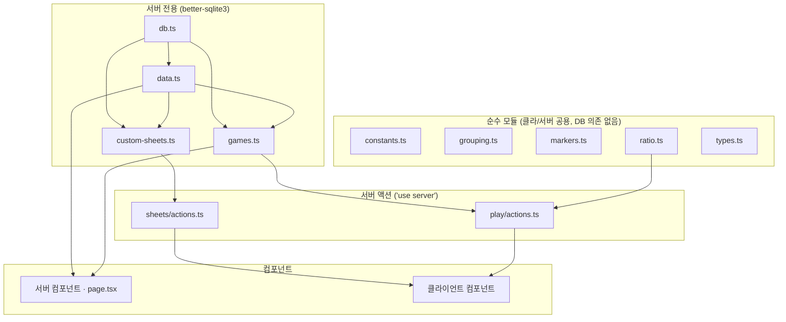

# 03 · 아키텍처

[← 데이터 파이프라인](02-data-pipeline.md) · [홈](README.md) · 다음: [그리모어 엔진 →](04-grimoire-engine.md)

## 레이어 지도

## 경계 규칙 (중요)

`better-sqlite3`를 import하는 모듈([db.ts](../../lib/db.ts) · [data.ts](../../lib/data.ts) ·
[custom-sheets.ts](../../lib/custom-sheets.ts) · [games.ts](../../lib/games.ts))은 **서버 전용**.
클라이언트 컴포넌트가 실수로 import하면 **빌드가 깨진다**(의도된 가드).

그래서 클라에서 쓰는 로직은 전부 **순수 모듈**로 분리:
[constants](../../lib/constants.ts)(팀·에디션) · [grouping](../../lib/grouping.ts)(팀 그룹핑) ·
[markers](../../lib/markers.ts)(상태이상) · [ratio](../../lib/ratio.ts)(인원 비율) ·
[types](../../lib/types.ts).

[db.ts](../../lib/db.ts)는 `process.cwd()/db/grimoire.db`를 `fileMustExist`로 연다(시드 안 됐으면
명확히 실패 → `npm run db:seed`). WAL 모드.

## 라우트 맵

| 경로 | 종류 | 설명 |
|---|---|---|
| `/` | 정적 | 직업 목록 + 필터/검색 |
| `/characters/[id]` | SSG (183) | 직업 상세 + 한/영 토글 |
| `/sheets` | 동적 | 공식 + 커스텀 시트 목록 |
| `/sheets/[id]` | SSG+동적 | 시트 상세 + 야간순서표 + `시작하기` |
| `/sheets/new`, `/sheets/[id]/edit` | 정적/동적 | 커스텀 시트 생성·수정 |
| `/rules` | 정적 | 규칙 + 목차 |
| `/games` | 동적 | 게임 목록 |
| `/play/setup/[sheetId]` | 동적 | 준비 스텝 |
| `/play/[gameId]` | 동적 | 진행 스텝 또는 복기 |

콘텐츠는 정적/SSG(빌드 시 SQLite 읽음), 게임·커스텀시트는 `force-dynamic`(가변).

## 커스텀 시트 — [lib/custom-sheets.ts](../../lib/custom-sheets.ts)

`custom_sheets` + `custom_sheet_characters` 테이블에 저장. 콘텐츠 테이블과 분리돼 있어
**재시드해도 보존**된다. CRUD는 [app/sheets/actions.ts](../../app/sheets/actions.ts) 서버 액션.

---
[← 데이터 파이프라인](02-data-pipeline.md) · [홈](README.md) · 다음: [그리모어 엔진 →](04-grimoire-engine.md)
