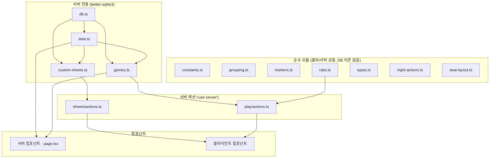

# 03 · 아키텍처

[← 데이터 파이프라인](02-data-pipeline.md) · [홈](README.md) · 다음: [그리모어 엔진 →](04-grimoire-engine.md)

## 레이어 지도

## 경계 규칙 (중요)

`better-sqlite3`를 import하는 모듈([db.ts](../../lib/db.ts) · [data.ts](../../lib/data.ts) ·
[custom-sheets.ts](../../lib/custom-sheets.ts) · [lib/games/](../../lib/games/))은 **서버 전용**.
클라이언트 컴포넌트가 실수로 import하면 **빌드가 깨진다**(의도된 가드).

그래서 클라에서 쓰는 로직은 전부 **순수 모듈**로 분리:
[constants](../../lib/constants.ts)(팀·에디션) · [grouping](../../lib/grouping.ts)(팀 그룹핑) ·
[markers](../../lib/markers.ts)(상태이상·직업토큰 마커) · [ratio](../../lib/ratio.ts)(인원 비율) ·
[behaviors](../../lib/behaviors.ts)(직업 동작 타입·레지스트리 — `data/behaviors.json` 정적 기본값 +
커스텀 런타임 오버레이) · [ability-catalog](../../lib/ability-catalog.ts)(조합 선택지 카탈로그 + 저장 값 검증 `validateBehavior`) ·
[night-actions](../../lib/night-actions.ts)(레지스트리 조회 계층·정보 능력 오인 경고) ·
[seat-layout](../../lib/seat-layout.ts)(사각 좌석 자동 배분·둘레 좌표) · [types](../../lib/types.ts).

[realtime.ts](../../lib/realtime.ts)는 서버 전용이되 **DB 의존이 없다**(`node:events`만 사용).
게임 변경 신호를 인메모리로 pub/sub하며, 서버 액션이 emit하고 SSE route handler가 구독한다([05](05-state-sync.md)).

온라인 플레이([11](11-online-play.md))는 [rooms.ts](../../lib/rooms.ts)(서버 전용, 룸/멤버/초대 CRUD) ·
[role-assign.ts](../../lib/role-assign.ts)(서버 전용, 직업 배정 — 게임/룸 시작 공유) ·
[redact.ts](../../lib/redact.ts)(순수, 좌석별 비밀 제거)로 구성된다.

[db.ts](../../lib/db.ts)는 `process.cwd()/db/grimoire.db`를 `fileMustExist`로 연다(시드 안 됐으면
명확히 실패 → `npm run db:seed`). WAL 모드. 환경변수 `BOTC_DB_FILE`이 있으면 그 파일을 대신 연다 —
시뮬 하네스(`npm run sim`, [11](11-online-play.md#회귀-테스트--시뮬레이션-하네스-scriptssim-onlinets))가
실 DB 사본에만 대고 돌기 위한 격리 훅(운영엔 영향 없음).

## 라우트 맵

| 경로 | 종류 | 설명 |
|---|---|---|
| `/` | 정적 | 직업 목록 + 필터/검색 |
| `/characters/[id]` | SSG (183) | 직업 상세 + 한/영 토글 (커스텀 직업 id는 동적 렌더). 우측은 능력 미리보기, **관리자에게는 그 자리가 동작 설정 패널** ([12](12-custom-characters.md)) |
| `/characters/custom` | 동적 | 내가 만든 커스텀 직업 목록(관리자는 전체) ([12](12-custom-characters.md)) |
| `/characters/custom/new`, `/characters/custom/[id]/edit` | 동적 | 커스텀 직업 빌더 — 기능 조합 + 라이브 미리보기 |
| `/sheets` | 동적 | 공식 + 커스텀 시트 목록 |
| `/sheets/[id]` | SSG+동적 | 시트 상세 + 야간순서표 + `시작하기` + `PNG 내보내기` |
| `/sheets/[id]/export` | SSG+동적 | 직업 설명 + 밤 순서·징크스 A4 PNG 내보내기 ([09](09-storyteller-tools.md)) |
| `/sheets/new`, `/sheets/[id]/edit` | 정적/동적 | 커스텀 시트 생성·수정 |
| `/rules` | 정적 | 규칙 + 목차 |
| `/games` | 동적 | 게임 목록(내역) — 검색·필터·게임별 이름 지정 |
| `/stats` | 동적 | 통계 — 종료 게임 집계(플레이어 순위·게임별 기록) |
| `/play/setup/[sheetId]` | 동적 | 준비 스텝 |
| `/play/[gameId]` | 동적 | 진행 스텝(이야기꾼) 또는 복기 |
| `/play/[gameId]/seat` | 동적 | 폰 플레이어 뷰 — 자기 자리 직업만 ([09](09-storyteller-tools.md)) |
| `/play/[gameId]/show/[seat]` | 동적 | 보여주기 풀스크린(`?as=`·`?mode=`·`?v=`) ([09](09-storyteller-tools.md)) |
| `/play/[gameId]/pick/[seat]` · `/claim` | 동적 | 직업 목록(플레이어 선택) · 잠금 직업배포 |
| `/login`, `/register`, `/account` | 동적 | 로그인·가입·내 계정([10](10-auth.md)) |
| `/admin` | 동적 | 사용자 역할 부여(관리자 전용) |
| `/rooms`, `/rooms/[roomId]`(로비), `/rooms/join/[code]` | 동적 | 온라인 방·로비·입장 ([11](11-online-play.md)) |
| `/rooms/[roomId]/play` · `/seat` | 동적 | 온라인 진행(이야기꾼 보드)·내 자리 — 기존 `/play`와 분리, 컴포넌트 재사용 ([11](11-online-play.md)) |
| `/api/games/[gameId]/stream` · `/api/rooms/[roomId]/stream` | SSE | 실시간 게임/룸 변경 푸시 ([05](05-state-sync.md), [11](11-online-play.md)) |

콘텐츠는 정적/SSG(빌드 시 SQLite 읽음), 게임·커스텀시트는 `force-dynamic`(가변).
실시간 스트림(`/api/.../stream`)은 `dynamic="force-dynamic"`·`runtime="nodejs"`의 route handler.

## 인증·인가 레이어 → [10](10-auth.md)

`lib/auth.ts`(서버 전용, better-sqlite3)가 `users`/`sessions` 테이블·세션 쿠키·역할 가드를
제공한다. 클라이언트는 역할 상수를 순수 모듈 `lib/auth-roles.ts`에서만 가져온다(런타임 import 금지).
접근제어는 두 겹 — **UI 게이팅**(클라이언트 `AuthProvider` 컨텍스트)과 **보안 강제**(서버 액션·민감
페이지의 `requireUser/Storyteller/Admin`·소유권 검사). 시트/게임은 `owner_id`로 소유자를 추적한다.

## 커스텀 시트 — [lib/custom-sheets.ts](../../lib/custom-sheets.ts)

`custom_sheets` + `custom_sheet_characters` 테이블에 저장. 콘텐츠 테이블과 분리돼 있어
**재시드해도 보존**된다. CRUD는 [app/sheets/actions.ts](../../app/sheets/actions.ts) 서버 액션.

## 커스텀 직업 — [lib/custom-characters.ts](../../lib/custom-characters.ts)

`custom_characters`(사용자가 만든 직업) + `character_overrides`(공식 직업 동작 수정분). 같은 이유로
콘텐츠 테이블과 분리 → 재시드해도 보존. [getCharacter](../../lib/data.ts)가 공식 miss 시 여기를 찾고
override를 얹으므로 `charactersForSheet`·`characterMapForGame` 등 **기존 소비자가 수정 없이** 커스텀을
그린다. 동작 정의는 로드·쓰기 시 [behaviors 레지스트리](../../lib/behaviors.ts)에 install된다. → [12](12-custom-characters.md)

---
[← 데이터 파이프라인](02-data-pipeline.md) · [홈](README.md) · 다음: [그리모어 엔진 →](04-grimoire-engine.md)
