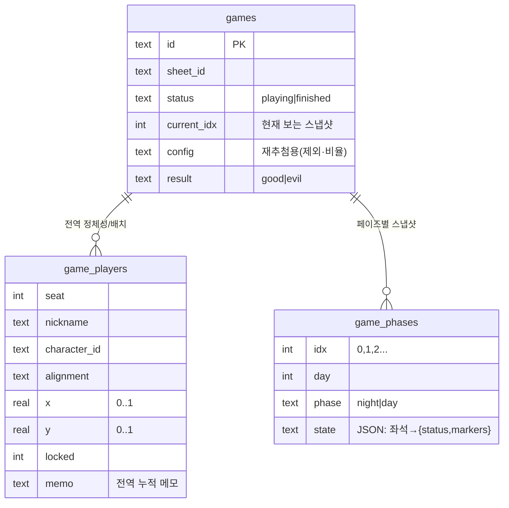

# 04 · 그리모어 엔진 (핵심)

[← 아키텍처](03-architecture.md) · [홈](README.md) · 다음: [상태 동기화 →](05-state-sync.md)

전부 [lib/games.ts](../../lib/games.ts)에 있다. 여기만 이해하면 게임 로직의 90%를 안다.

## 핵심 아이디어: 정체성 ↔ 페이즈 스냅샷 분리

물리 그리모어를 떠올리자. **자리 배치와 누가 무슨 직업인지**는 게임 내내 거의 안 바뀐다.
반면 **누가 죽었고 무슨 효과를 받았는지**는 매 페이즈(밤/낮)마다 바뀐다. 한 덩어리로 저장하면
"어젯밤 상태로 되돌리기"가 불가능하다. 그래서 분리한다.



- **`game_players`** = 전역. 좌석·닉네임·직업·진영·캔버스 위치(0~1 비율)·고정·메모. 페이즈 무관.
- **`game_phases`** = 페이즈별 독립 스냅샷. `state` = `{ [seat]: {status, markers[]} }` JSON.
  `games.current_idx`가 지금 보는 스냅샷을 가리킨다.

`getGame()`은 둘을 합쳐 `Game`(전역 + 현재 스냅샷 상태)을 돌려준다. 화면은 한 장의 일관된
보드로 보이지만 실제론 "현재 인덱스 스냅샷"을 그리는 것.

## 페이즈 진행

```mermaid
flowchart TD
  Start([다음 페이즈]) --> Q{현재가 최신 스냅샷?}
  Q -->|아니오 (과거→진행)| Move[current_idx++<br/>기존 스냅샷으로 이동]
  Q -->|예| Copy[현재 state 복사]
  Copy --> Exp["마커 만료<br/>keepMarkerOnAdvance()"]
  Exp --> Calc["밤↔낮 전환·일차 계산<br/>낮→밤이면 day+1"]
  Calc --> Ins[새 스냅샷 삽입 + current_idx++]
```

핵심: **과거 페이즈로 갔다가 다시 진행하면 새로 만들지 않고 기존 스냅샷으로 포인터만 이동.**
과거 스냅샷을 수정해도 다른 페이즈로 전파(cascade)되지 않는다 — 각 페이즈는 독립 데이터셋.
이게 "복기"와 "되돌려서 고치기"를 동시에 가능하게 한다. (`prevPhase`는 포인터만 이동.)

## 상태이상(마커)과 지속 — [lib/markers.ts](../../lib/markers.ts)

마커는 `"base"` 또는 `"base:param"` 문자열. `duration`이 만료 규칙을 정한다.

| duration | 소멸 시점 | 예 |
|---|---|---|
| `phase` | 다음 페이즈로 넘어가면 (밤→낮·낮→밤 모두) | 보호, 사망예정 |
| `dusk` | 황혼(낮 종료)까지 → **낮→밤**에만 소멸 | 중독, 집착, 취함(황혼까지) |
| `permanent` | 자동 소멸 안 함 | 취함(영구) |

- 표현은 BotC 관례대로 **원인 직업 토큰 이미지**(중독=독살자, 취함=주정뱅이, 집착=세레노버스,
  보호=수도사, 사망예정=임프). `public/icons`의 직업 토큰 재사용.
- **집착**은 대상 역할을 함께 저장(`mad:<roleId>`)하고 토큰·복기에 대상명 표시.
- 사망은 마커가 아니라 `status`로 관리(영구).
- `toggleMarker`는 base 기준: 같은 마커면 해제, 다른 같은-base면 교체(집착 대상 바꾸기 등).

## 라이프사이클 & 액션

- **재추첨** `redrawRoles`: 직업/진영만 교체, 좌석·위치·닉네임 유지, 진행상태 초기화(idx 0).
  비율은 [play/actions.ts](../../app/play/actions.ts)의 `redrawAction`이 **현재 플레이어 팀 구성에서
  도출**(저장 config가 비어도 안전).
- **직업 변경/교체** `setRoles` ← `setRoleAction`: 다른 좌석이 가진 직업을 고르면 두 좌석을 교체.
  1일차 밤(idx 0)에서만.
- **사망/마커/메모/고정/위치**: `setStatus`·`toggleMarker`·`setMemo`·`setLock`·`savePositions`.
  앞 3개는 현재 스냅샷 상태를, 뒤 2개는 전역(`game_players`)을 변경.
- **종료** `finishGame`: `status='finished'` + 결과. 종료 게임은 `getHistory`로 모든 스냅샷을
  읽어 [GameReplay](../../components/GameReplay.tsx)(복기)로 렌더.

## 구버전 마이그레이션

초기 구현은 단일 라이브 상태 + append 로그(`game_log`)였다. `games.ts` 로드 시 1회성
마이그레이션이 `game_log`(과거) + 현재 라이브 상태를 묶어 `game_phases`로 이관한다(이미 이관된
게임은 건너뜀). 스키마를 바꿔도 기존 테스트 게임이 깨지지 않는다.

---
[← 아키텍처](03-architecture.md) · [홈](README.md) · 다음: [상태 동기화 →](05-state-sync.md)
