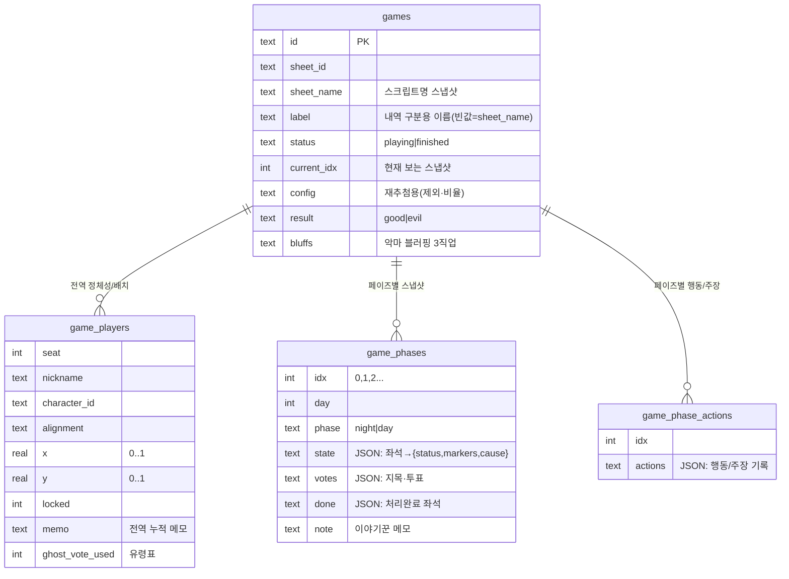

# 04 · 그리모어 엔진 (핵심)

[← 아키텍처](03-architecture.md) · [홈](README.md) · 다음: [상태 동기화 →](05-state-sync.md)

전부 [lib/games/](../../lib/games/) 모듈에 있다 — `schema.ts`(DDL·마이그레이션·공용 헬퍼) ·
`lifecycle.ts`(생성·복제·조회·재추첨·페이즈·종료·복기·목록·삭제·이름변경) · `seats.ts`(좌석 조작) ·
`phase-data.ts`(행동·투표·완료·메모·타이머) · `meta.ts`(블러핑·claim·글로벌 마커·미치광이·disguise) ·
`stats.ts`(종료 게임 통계·닉네임 집계) · `undo.ts`(실행 취소), `index.ts`가 전부 재수출.
여기만 이해하면 게임 로직의 90%를 안다.

## 핵심 아이디어: 정체성 ↔ 페이즈 스냅샷 분리

물리 그리모어를 떠올리자. **자리 배치와 누가 무슨 직업인지**는 게임 내내 거의 안 바뀐다.
반면 **누가 죽었고 무슨 효과를 받았는지**는 매 페이즈(밤/낮)마다 바뀐다. 한 덩어리로 저장하면
"어젯밤 상태로 되돌리기"가 불가능하다. 그래서 분리한다.



- **`game_players`** = 전역. 좌석·닉네임·직업·진영·캔버스 위치(0~1 비율)·고정·메모·유령표. 페이즈 무관.
- **`game_phases`** = 페이즈별 독립 스냅샷. `state` = `{ [seat]: {status, markers[], cause} }` JSON.
  여기에 그날의 지목·투표(`votes`)·처리완료(`done`)·메모(`note`)도 함께. `games.current_idx`가
  지금 보는 스냅샷을 가리킨다.
- **`game_phase_actions`** = 페이즈별 야간/낮 행동·주장 기록(별도 테이블). 다음 페이즈로 복사 안 함.

> 운영 기록(행동·주장·투표·블러핑·운영보조·폰 뷰)의 전모는 → [09 이야기꾼 운영 도구](09-storyteller-tools.md).

`getGame()`은 둘을 합쳐 `Game`(전역 + 현재 스냅샷 상태)을 돌려준다. 화면은 한 장의 일관된
보드로 보이지만 실제론 "현재 인덱스 스냅샷"을 그리는 것.

## 페이즈 진행

```mermaid
flowchart TD
  Start([다음 페이즈]) --> Q{현재가 최신 스냅샷?}
  Q -->|아니오 (과거→진행)| Move[current_idx++<br/>기존 스냅샷으로 이동]
  Q -->|예| Copy[현재 state 복사]
  Copy --> Exp["마커 만료<br/>keepMarkerOnAdvance()"]
  Exp --> AutoN["밤→낮 자동처리<br/>dying 마커 좌석 자동 사망(cause=night)"]
  AutoN --> AutoD["낮→밤 자동처리<br/>변절(turning)·식인종 처형 능력 획득"]
  AutoD --> Calc["밤↔낮 전환·일차 계산<br/>낮→밤이면 day+1"]
  Calc --> Ins[새 스냅샷 삽입 + current_idx++]
```

[advancePhase](../../lib/games/lifecycle.ts)의 자동 처리:

- **밤→낮**: 살아있던 좌석에 `dying`(사망예정) 마커가 있으면 자동으로 `status='dead'`, `cause='night'`.
  `dying`은 ST가 보호 판단까지 끝내고 "죽음 확정"으로 단 마커이므로(보호되면 애초에 안 단다) 여기서 죽인다.
  `dying`은 `phase` 지속이라 다음 스냅샷에선 사라진다. 낮에 다는 `dying`(슬레이어·처녀 즉시 처리)은
  ST가 직접 사망 처리하므로 제외(밤→낮에서만).
- **낮→밤**: **변절**(turning 마커 좌석 → alignment=evil), **식인종**(그 낮 처형 대상의 능력을
  `gained:<직업>`로 부여, 악이면 취함(영구)·선이면 취함 해제 — 처형마다 갱신, 재획득 시
  기존 gained/noability/취함을 비우고 새 능력만 적용). → [09](09-storyteller-tools.md)

핵심: **과거 페이즈로 갔다가 다시 진행하면 새로 만들지 않고 기존 스냅샷으로 포인터만 이동.**
과거 스냅샷을 수정해도 다른 페이즈로 전파(cascade)되지 않는다 — 각 페이즈는 독립 데이터셋.
이게 "복기"와 "되돌려서 고치기"를 동시에 가능하게 한다. (`prevPhase`는 포인터만 이동.)

## 상태이상(마커)과 지속 — [lib/markers.ts](../../lib/markers.ts)

마커는 `"base"` 또는 `"base:param"` 문자열. `duration`이 만료 규칙을 정한다.

| duration | 소멸 시점 | 예 |
|---|---|---|
| `phase` | 다음 페이즈로 넘어가면 (밤→낮·낮→밤 모두) | 보호(수도사·여관주인), 사망예정 |
| `dusk` | 황혼(낮 종료)까지 → **낮→밤**에만 소멸 | 중독, 집착, 취함(황혼까지), **처형 생존(악마의 변호사)** |
| `permanent` | 자동 소멸 안 함 | 취함(영구) |

> **보호(`protected`) vs 처형 생존(`execsafe`)** — 수도사·여관주인의 보호는 *그 밤의 데몬 킬* 방어라 `phase`(밤→낮에 소멸)로 정확하다.
> 악마의 변호사는 *다음 낮의 처형*을 막아야 하는데 `phase`면 밤→낮 전환에 사라져 정작 처형 시점엔 없어진다 → **`dusk` 수명의 별도 `execsafe` 마커**로 분리(밤→낮 유지, 그 낮 황혼에 소멸). 둘 다 사망은 ST 수동 판정용 리마인더(자동 킬 로직이 참조하지 않음).

- 표현은 BotC 관례대로 **원인 직업 토큰 이미지**(중독=독살자, 취함=주정뱅이, 집착=세레노버스,
  보호=수도사, 사망예정=임프). `public/icons`의 직업 토큰 재사용.
- **직업을 가리키는 마커**(`roleParam`): 집착 `mad:<role>`(세레노버스+대상 토큰), 직업 변경
  `became:<role>`(↺), 능력 획득 `gained:<role>`(✦), 능력 없음 `noability:<role>`(✕, 일회성 소진),
  레드헤링 `herring`. [MarkerToken](../../components/MarkerToken.tsx)이 param 직업의 심볼로 렌더 →
  정체성은 마커로만 얹어 과거 스냅샷 불변. (→ [09](09-storyteller-tools.md))
- **다중 마커**(`multi`): `gained`·`noability`는 한 좌석에 여러 인스턴스 공존 가능(식인종이 철학자를 먹고
  → 철학자 능력으로 또 다른 직업을 얻는 식). 나머지(집착·직업 변경 등)는 단일 — 동일 base는 교체.
- `disguise`/`gained`/`became`는 [`effectiveCharacterId`](../../lib/markers.ts)가 "운영상 다루는 직업"을
  정하는 데 쓴다(disguise > gained/became > 원래). `noability:<role>`는 일회성 능력 소진을 직업별로
  표시 — 한 좌석에 여러 일회성(철학자+획득직업 등)이 있어도 직업 단위로 정확히 판정.
- 사망은 마커가 아니라 `status`로 관리(+사망 원인 `cause`).
- `toggleMarker`: 정확히 같은 문자열이면 해제. 그 외에는 `multi` 마커(`gained`·`noability`)면 동일 base를
  지우지 않고 누적, 단일 마커면 동일 base를 교체(집착/변경 대상 바꾸기 등).

## 라이프사이클 & 액션

- **복제** `cloneGame` ← `cloneGameAction`: 같은 사람들로 다음 판을 빠르게 시작. 정체성(좌석·닉네임·직업·
  진영·배치·고정)과 셋업(시트·구성·블러핑·위장·미치광이 블러핑/하수인)은 그대로 가져오되, 진행 상태
  (행동·투표·마커·사망·메모·유령표·되돌리기·직업배포 점유)는 모두 비운 **새 "1일차 밤" 게임**을 만든다.
  `label`은 `(사본)` 접미. 직업은 유지 — 새 직업이 필요하면 새 게임에서 재추첨.
  [GamesBrowser](../../components/GamesBrowser.tsx)의 게임 카드에서 호출 → 새 게임 진행 화면으로 redirect.
- **재추첨** `redrawRoles`: 직업/진영만 교체, 좌석·위치·닉네임 유지, 진행상태 초기화(idx 0).
  비율은 [play/actions.ts](../../app/play/actions.ts)의 `redrawAction`이 **현재 플레이어 팀 구성에서
  도출**(저장 config가 비어도 안전).
- **직업 변경/교체** `setRoles` ← `setRoleAction`: 다른 좌석이 가진 직업을 고르면 두 좌석을 교체.
  1일차 밤(idx 0)에서만.
- **사망/마커/메모/고정/위치**: `setStatus`(+cause)·`toggleMarker`·`setMemo`·`setLock`·`savePositions`.
- **운영 기록**: `recordAction`/`clearAction`(행동·주장)·`recordVote`/`clearVote`(투표)·`toggleDone`·
  `setNote`·`setGhostVote`·`setBluffs`. 대부분 현재 스냅샷에, 유령표·블러핑은 전역에 쓴다.
  자세히 → [09 이야기꾼 운영 도구](09-storyteller-tools.md).
- **종료** `finishGame`: `status='finished'` + 결과. 종료 게임은 `getHistory`로 모든 스냅샷을
  읽어 [GameReplay](../../components/GameReplay.tsx)(복기)로 렌더.

## 좌석 자동 배치 — [lib/seat-layout.ts](../../lib/seat-layout.ts)

좌석 위치(`x`/`y`, 0~1 비율)는 정체성 데이터다(`game_players`, 페이즈 무관). 자동 정렬은 순수 모듈로 분리.

- 원형 배치는 [PlayCanvas](../../components/PlayCanvas.tsx) 인라인, **사각(직사각) 배치**는 이 모듈.
  실제 오프라인 테이블은 직사각에 가까워, 사각으로 배치하면 좌·우 이웃·마주보는 자리 같은 좌석 관계가
  토큰을 보여줄 때 더 정확히 드러난다.
- `autoRectSides(n)`: 인원 N을 4면에 자동 배분 — 상·하(가로 약 32%)를 좌·우보다 많게. 합은 항상 N.
- `rectPositions(sides)`: 시계방향(상 L→R → 우 → 하 R→L → 좌)으로 둘레 균등 좌표를 만들어 이웃 관계를 보존.
  `sidesTotal(sides)`는 면별 합(인원 검증용).
- [HeaderToolbar](../../components/HeaderToolbar.tsx)의 '정렬' 드롭다운(원형/사각 + 면별 인원 입력)이
  좌표를 계산하고, PlayCanvas가 `savePositions`로 일괄 저장한다. 전체화면 첩자 시점은 저장된 좌표(슬롯)는
  그대로 두고 좌석→슬롯 배정만 회전시켜 어떤 배치 모양(원형/사각/수동)이든 보존한다.

## 구버전 마이그레이션

초기 구현은 단일 라이브 상태 + append 로그(`game_log`)였다. `games.ts` 로드 시 1회성
마이그레이션이 `game_log`(과거) + 현재 라이브 상태를 묶어 `game_phases`로 이관한다(이미 이관된
게임은 건너뜀). 스키마를 바꿔도 기존 테스트 게임이 깨지지 않는다.

---
[← 아키텍처](03-architecture.md) · [홈](README.md) · 다음: [상태 동기화 →](05-state-sync.md)
