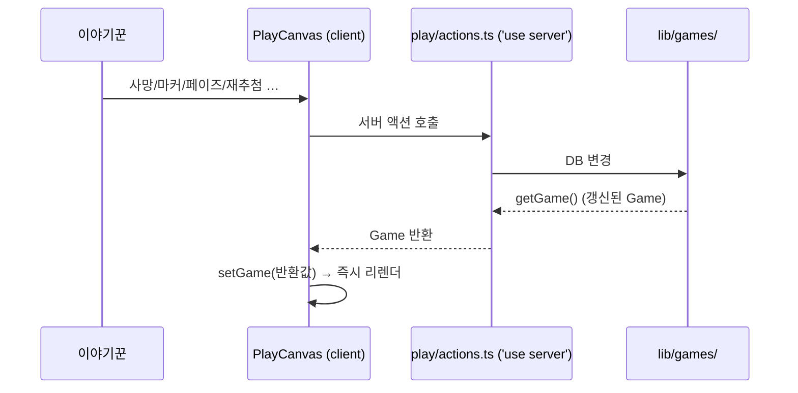
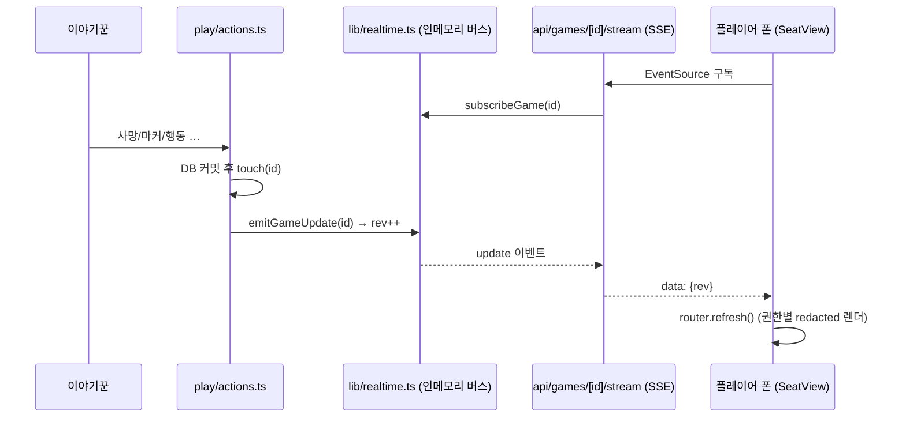

# 05 · 상태 동기화 · 렌더링

[← 그리모어 엔진](04-grimoire-engine.md) · [홈](README.md) · 다음: [준비 스텝 →](06-setup-and-ratio.md)

## 액션 → setGame 패턴

진행 화면([PlayCanvas](../../components/PlayCanvas.tsx))과 DB는 이렇게 동기화된다.

거의 모든 액션이 **갱신된 `Game`을 반환**하고 클라가 `setGame`으로 교체한다(낙관적 추정 대신
서버 권위 값). 로컬 SQLite라 왕복이 빨라 충분히 즉각적이다. 단일 사용자(이야기꾼)라 동시성
충돌도 사실상 없다. 신규 액션(`toggleGhostVoteAction`, `setDisguiseAction`, `cloneGameAction` 등)도
같은 규약을 따른다 — 반환형이 `Game`이면 `setGame`, `void`면 `redirect`/`revalidatePath`.

예외(`Game`을 반환하지 않는 액션):
- **위치 드래그·정렬**: 클라가 먼저 움직이고 손을 뗄 때 `savePositionsAction`으로 저장(잦은 호출 방지).
  원형/사각 자동 정렬도 `applyPositions`가 로컬 `setGame` 후 `savePositionsAction`만 호출한다(아래 참고).
- **게임 종료**: `finishGameAction`은 `redirect`로 복기 화면으로 전환.
- **게임 복제**: `cloneGameAction`은 `cloneGame`으로 같은 셋업의 새 1일차 밤 게임을 만들고
  새 진행 화면으로 `redirect`.

> `setDisguiseAction`은 가짜 직업을 지정할 때 그 직업이 악마 블러핑(`game.bluffs`)에 있으면
> 자동으로 빼낸다(누군가 자기 직업으로 믿는 직업은 인플레이처럼 취급).

## 실시간 푸시(SSE) — 온라인 플레이 P1

위 `setGame` 왕복은 **변경을 일으킨 본인(이야기꾼)** 화면만 즉시 갱신한다. 같은 게임을 보는
다른 클라(플레이어 폰)는 예전엔 [SeatView](../../components/SeatView.tsx)가 15초마다
`router.refresh()`로 폴링했다. 온라인 플레이를 위해 이를 **SSE 푸시**로 바꿨다.

- [lib/realtime.ts](../../lib/realtime.ts): 게임별 `EventEmitter` pub/sub. **진실 원천은 여전히
  SQLite** — 버스는 "바뀜" 신호(`rev`)만 흘리고 본문은 안 싣는다. 그래서 클라는 신호를 받으면
  *자기 권한에 맞는 경로*로 다시 fetch/refresh → 비밀 정보(다른 좌석 직업)가 버스로 새지 않는다.
- 단일 장기실행 Node 프로세스(노트북+터널·작은 VPS 모두) 전제라 인메모리로 충분. 외부 의존성 0.
  서버리스로 가면 이 파일의 emit/subscribe 구현만 외부 pub/sub로 교체(호출부 불변).
- emit seam: 거의 모든 mutating 액션이 `return getGame(id)!` 대신 `return touch(id)`
  ([play/actions.ts](../../app/play/actions.ts))를 써서 커밋 직후 한 번 emit. `void`/`redirect`
  액션(종료·위치저장·삭제·점유 등)은 `emitGameUpdate(id)`를 직접 호출.
- 클라: [useGameStream](../../components/useGameStream.ts) 훅이 `EventSource`로 구독(자동 재연결).
  SeatView가 이를 써서 `update`마다 `router.refresh()`. 15초 폴링은 30초 fallback으로 남겼다.
- [proxy.ts](../../proxy.ts) matcher에서 `api/`를 제외 — claim 쿠키가 있어도 SSE가
  claim 페이지로 리다이렉트되지 않게.

> 이야기꾼 보드([PlayCanvas](../../components/PlayCanvas.tsx))는 아직 SSE 미구독이다.
> 자기 변경은 낙관적 `setGame`이라 불필요하고, **플레이어발 변경**을 ST가 봐야 하는
> 밤 행동 요청/응답(추후 단계)에서 `getGameAction` refetch + `setGame`을 붙인다.

## 왜 시트 전체를 클라에 넘기나

[app/play/[gameId]/page.tsx](../../app/play/[gameId]/page.tsx)는 현재 인플레이 직업만이 아니라
**시트 전체 직업(`sheetChars: Character[]`, 상세 데이터 포함)**을 prop으로 넘긴다.

이유: 재추첨·직업변경은 클라에서 `setGame`으로 즉시 반영되는데, 바뀐 새 직업의 아이콘/이름/능력이
클라에 없으면 못 그린다. (예전 버그: 새로고침해야 새 직업이 보였음 — 당시엔 현재 직업만 넘겼기 때문.)

시트 전체를 들고 있으면:
- 재추첨/직업변경 후 **서버 왕복 없이 즉시** 정확히 렌더
- `상세 능력` 모달, `집착 대상` 선택, 미사용 직업 표시까지 같은 데이터로 해결

종료 게임의 [GameReplay](../../components/GameReplay.tsx)도 같은 `sheetChars`를 받아 일관되게 렌더.

> 준비/진행 페이지는 `knownNicknames`(이전 게임 닉네임)도 prop으로 내려 닉네임 입력 자동완성에 쓴다.

## 좌석 선택 UI — PlayerPicker (native select 대체)

플레이어(좌석)를 고르는 자리는 native `<select>` 대신 [PlayerPicker](../../components/PlayerPicker.tsx)를 쓴다.
트리거 버튼 + portal 토큰 그리드 모달(Escape·모바일 뒤로가기로 닫힘, `data-modal`이라 선택 패널 자동 닫기에
걸리지 않음) 구조로, 닉네임·좌석번호·사망 여부를 큰 칸으로 보여줘 모바일에서 고르기 쉽다.

- `value: number | null` (좌석, `null`=미선택) / `onChange(seat | null)` 패턴.
- `exclude`로 특정 좌석 제외, `allowClear`로 '선택 안 함' 칸, `actionMode`로 선택 후 트리거에 값을
  표시하지 않게(자리 교환처럼 즉시 실행 후 리셋되는 용도).

쓰는 곳: [SelectionPanel](../../components/SelectionPanel.tsx)의 자리 교환(1일차 밤),
[VotesSidebar](../../components/VotesSidebar.tsx)의 지목자/대상 선택. 선택값은 그대로 서버 액션
(`swapSeatsAction`, `recordVoteAction` 등)에 넘어가 위의 `Game` 반환→`setGame` 흐름을 탄다.

## 캔버스 좌표 렌더링 — 정렬·전체화면

[PlayCanvas](../../components/PlayCanvas.tsx)는 좌석 토큰을 `player.x/y`(0~1 정규화) 절대 좌표로 그린다.

- **정렬**: `arrangeCircle`(원형)과 `arrangeRect`(사각 둘레)를 `applyPositions`로 통합한다.
  `applyPositions`는 로컬 `setGame`으로 즉시 좌표를 반영하고 `savePositionsAction`만 호출(전체 `Game`
  왕복 없음). 사각 좌표는 순수 모듈 [lib/seat-layout.ts](../../lib/seat-layout.ts)의
  `autoRectSides`/`rectPositions`/`sidesTotal`로 계산하며, 면별 인원 입력은 [HeaderToolbar](../../components/HeaderToolbar.tsx)
  (`onArrangeCircle`/`onArrangeRect`)에서 받는다.
- **전체화면(첩자용 그리모어)**: 보드(`boardRef`)만 네이티브 풀스크린으로 띄우고 토큰 배율을 1.8배
  (`tokenScale`)로 키운다. `MarkerToken`에 `showLabel`을 줘 토큰 아래 한글 라벨을 표시하고,
  [GrimoireLegend](../../components/GrimoireLegend.tsx)를 보드 안에 렌더해 기호 의미 범례를 띄운다.
- **첩자 시점(`spyView`)**: 저장된 좌표(슬롯)는 그대로 두고 좌석→슬롯 배정만 회전시켜 첩자를 하단
  중앙 슬롯으로 보낸다. 원형/사각/수동 어떤 배치든 모양을 유지한 채 첩자만 6시 방향으로 온다.
  전체화면 중엔 드래그(`onMove`)를 막아 저장 좌표 오염을 방지한다.

---
[← 그리모어 엔진](04-grimoire-engine.md) · [홈](README.md) · 다음: [준비 스텝 →](06-setup-and-ratio.md)
