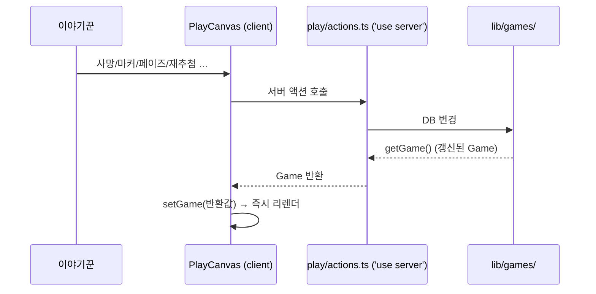

# 05 · 상태 동기화 · 렌더링

[← 그리모어 엔진](04-grimoire-engine.md) · [홈](README.md) · 다음: [준비 스텝 →](06-setup-and-ratio.md)

## 액션 → setGame 패턴

진행 화면([PlayCanvas](../../components/PlayCanvas.tsx))과 DB는 이렇게 동기화된다.

거의 모든 액션이 **갱신된 `Game`을 반환**하고 클라가 `setGame`으로 교체한다(낙관적 추정 대신
서버 권위 값). 로컬 SQLite라 왕복이 빨라 충분히 즉각적이다. 단일 사용자(이야기꾼)라 동시성
충돌도 사실상 없다.

예외:
- **위치 드래그**: 클라가 먼저 움직이고 손을 뗄 때 `savePositionsAction`으로 저장(잦은 호출 방지).
- **게임 종료**: `finishGameAction`은 `redirect`로 복기 화면으로 전환.

## 왜 시트 전체를 클라에 넘기나

[app/play/[gameId]/page.tsx](../../app/play/[gameId]/page.tsx)는 현재 인플레이 직업만이 아니라
**시트 전체 직업(`sheetChars: Character[]`, 상세 데이터 포함)**을 prop으로 넘긴다.

이유: 재추첨·직업변경은 클라에서 `setGame`으로 즉시 반영되는데, 바뀐 새 직업의 아이콘/이름/능력이
클라에 없으면 못 그린다. (예전 버그: 새로고침해야 새 직업이 보였음 — 당시엔 현재 직업만 넘겼기 때문.)

시트 전체를 들고 있으면:
- 재추첨/직업변경 후 **서버 왕복 없이 즉시** 정확히 렌더
- `상세 능력` 모달, `집착 대상` 선택, 미사용 직업 표시까지 같은 데이터로 해결

종료 게임의 [GameReplay](../../components/GameReplay.tsx)도 같은 `sheetChars`를 받아 일관되게 렌더.

---
[← 그리모어 엔진](04-grimoire-engine.md) · [홈](README.md) · 다음: [준비 스텝 →](06-setup-and-ratio.md)
