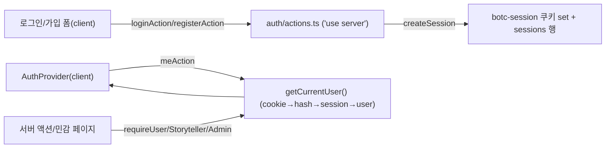

# 10 · 인증·인가·권한

[← 이야기꾼 운영 도구](09-storyteller-tools.md) · [홈](README.md)

로그인·세션·역할 기반 접근제어(RBAC). 외부 의존성 없이 **SQLite + Node 내장 crypto**만으로
구현한다(로컬 LAN·인터넷 없는 환경 철학 유지).

## 한눈에 — 권한 매트릭스

| 대상 | 익명 | 로그인(플레이어) | 이야기꾼 | 관리자 |
|---|---|---|---|---|
| 직업(`/`)·통계(`/stats`)·규칙(`/rules`) 열람 | ✅ | ✅ | ✅ | ✅ |
| 시트 열람 · PNG 내보내기 | ✅ | ✅ | ✅ | ✅ |
| 새 시트 만들기 | ❌ | ✅ | ✅ | ✅ |
| 시트 수정·삭제 | ❌ | 본인 것 | 본인 것 | 전부 |
| 게임 시작(`시작하기`)·진행 보드 | ❌ | ❌ | ✅ | ✅ |
| 게임 복제·삭제·이름변경 | ❌ | ❌ | 본인 것 | 전부 |
| 내역: 종료 게임 복기 | ✅ | ✅ | ✅ | ✅ |
| 내역: **진행 중** 게임 열람 | ❌ | ❌ | **본인 것만** | 전부 |
| 사용자 역할 부여 | ❌ | ❌ | ❌ | ✅ |
| 플레이어 폰 자리(`claim`/`seat`/`pick`/`show`) | ✅(로그인 불필요) | ✅ | ✅ | ✅ |

> 역할은 **중복 보유** 가능(`["admin","storyteller","player"]`). `admin`은 모든 권한을 포함한다.
> 가입 시 기본 `player`. 이야기꾼·관리자 승급은 **관리자만** (`/admin`).
> 다른 이야기꾼의 *진행 중* 게임은 목록에 안 보인다. 단 *종료* 게임 복기는 익명 포함 누구나.

## 데이터 모델 — [lib/auth.ts](../../lib/auth.ts)

게임·커스텀시트처럼 **가변 데이터**라 seed가 건드리지 않는 별도 테이블에 둔다(재시드 보존).

```sql
users(    id PK, login_id UNIQUE, nickname UNIQUE,
          password_hash, password_salt, roles(JSON), created_at )
sessions( token_hash PK, user_id, created_at, expires_at )
```

- **비밀번호**: `scrypt(pw, salt16B) → 64B`. 검증은 `timingSafeEqual`. salt는 사용자별 랜덤.
- **세션**: 추측 불가능한 랜덤 토큰(32B)을 **쿠키**(`botc-session`, httpOnly·sameSite=lax)에,
  DB엔 그 **SHA-256 해시만** 저장(DB 유출 대비). 만료 30일. 로그아웃 시 DB 행 삭제 + 쿠키 제거.
  로컬 http(LAN)에서도 동작해야 하므로 `secure`는 강제하지 않는다.
  - **비밀번호 변경 시** 해당 사용자의 **모든 세션을 폐기**(유출·탈취된 기존 접근 차단)하고 현재
    기기만 새 세션으로 재발급한다.
  - 새 세션 발급 시 **만료된 세션 행을 함께 정리**(기회적 cleanup)해 `sessions` 테이블 비대화를 막는다.
- **역할**: `users.roles` JSON 배열. 헬퍼 `hasRole/isAdmin/isStoryteller`(admin은 항상 true).
- **부트스트랩 관리자**: 모듈 로드 시 관리자가 0명이면 `admin / admin1234`(역할 전부)를 1회 시드.
  최초 로그인 후 [/account](../../app/account/page.tsx)에서 비밀번호 변경 권장.

### 소유권 컬럼 (멱등 마이그레이션)

| 테이블 | 컬럼 | 의미 | 레거시(null) |
|---|---|---|---|
| `custom_sheets` | `owner_id` | 시트 생성자 | 관리자만 수정/삭제 |
| `games` | `owner_id` | 게임을 시작한 이야기꾼 | 진행 중이면 관리자만 열람 |

기존 DB엔 `ALTER TABLE ... ADD COLUMN owner_id INTEGER`를 try/catch로 추가
([custom-sheets.ts](../../lib/custom-sheets.ts) · [games/schema.ts](../../lib/games/schema.ts)).

## 세션 흐름 (서버 권위)



## 인가는 두 겹 (UI 게이팅 ≠ 보안)

Next 권장: **보안 검사는 데이터 소스 가까이**. 서버 액션은 공개 POST 엔드포인트이므로
UI에서 버튼을 숨기는 것만으로는 부족하다 — **액션마다 권한을 재검증**한다.

1. **UI 게이팅(보여주기/숨기기)** — 클라이언트 [AuthProvider](../../components/AuthProvider.tsx) 컨텍스트.
   레이아웃에서 `cookies()`를 읽지 않으려고(=정적 페이지 보존) 마운트·경로변경 시
   `meAction`으로 현재 사용자를 가져온다. [AccountMenu](../../components/AccountMenu.tsx) ·
   [NewSheetButton](../../components/NewSheetButton.tsx) · [SheetActions](../../components/SheetActions.tsx) ·
   [GamesBrowser](../../components/GamesBrowser.tsx)가 역할로 분기.
   > 클라이언트 컴포넌트는 `lib/auth`(better-sqlite3) 대신 순수 모듈
   > [lib/auth-roles.ts](../../lib/auth-roles.ts)에서 역할 상수를 가져온다(런타임 import 금지).
2. **보안 강제(실제 차단)** — 서버.
   - 서버 액션: [play/actions.ts](../../app/play/actions.ts)의 `requireGameManager(gameId)`
     (소유 이야기꾼 또는 admin, 미인가 시 throw)를 **모든 변경 액션**에 적용.
     `startGameAction`은 이야기꾼 확인 + `ownerId` 설정, `cloneGameAction`은 원본 소유 확인 +
     새 소유자 설정. **예외: `claimSeatAction`만 무가드**(플레이어 폰 자리 점유).
     [sheets/actions.ts](../../app/sheets/actions.ts)는 생성=로그인, 수정/삭제=소유자/admin.
   - 페이지 가드(서버 컴포넌트, 미인가 시 `redirect`):
     [play/[gameId]](../../app/play/[gameId]/page.tsx)(진행중=소유/admin·종료=전체),
     [setup](../../app/play/setup/[sheetId]/page.tsx), [sheets/new](../../app/sheets/new/page.tsx),
     [sheets/[id]/edit](../../app/sheets/[id]/edit/page.tsx), [admin](../../app/admin/page.tsx),
     [account](../../app/account/page.tsx).
   - 목록 필터: [games/page.tsx](../../app/games/page.tsx)가 뷰어 기준으로 진행 중 게임을 거르고
     게임별 `canManage`를 계산해 내려준다.

> [proxy.ts](../../proxy.ts)는 인증과 무관하게 그대로다 — 직업배포 쿠키(`botc-claim-*`)를 가진
> 폰을 자기 게임 claim 페이지에 가두는 역할만 한다(엣지 런타임에서 DB를 못 보므로 인증은 안 한다).

## 통계 ↔ 가입 닉네임 동기화

통계는 예전처럼 **닉네임 문자열**로 집계한다([games/stats.ts](../../lib/games/stats.ts)). 따라서
게스트 닉네임으로 플레이한 기록은, 누군가 **같은 닉네임으로 가입하면 자동으로 그 계정에 연동**된다
(별도 백필 불필요). 리더보드·자동완성은 가입 닉네임을 `registered` 플래그로 구분한다:

- `nicknameLeaderboard()` — 각 행에 `registered`. 가입 유저를 먼저 정렬.
  [StatsView](../../components/StatsView.tsx)가 `가입`/`게스트` 배지 표시.
- `listKnownNicknames()` — 게임 기록 닉네임 + 가입 유저 닉네임 합집합(가입 우선). 셋업 자동완성용.
- 게임 셋업은 게스트 자유 닉네임을 그대로 허용한다(나중에 가입하면 연동).

## 라우트 (인증 관련)

| 경로 | 종류 | 설명 |
|---|---|---|
| `/login`, `/register` | 동적 | 로그인/가입 폼. 이미 로그인 시 홈으로 redirect |
| `/account` | 동적 | 내 정보·권한·비밀번호 변경(본인) |
| `/admin` | 동적 | 사용자 역할 부여(관리자 전용). 마지막 관리자 강등 방지 |

## 확장 메모

- **역할 추가**: [lib/auth-roles.ts](../../lib/auth-roles.ts)의 `Role`/`ALL_ROLES`/`ROLE_LABEL`에 추가 →
  `hasRole` 기반 가드/UI가 자동 반영.
- **새 변경 액션을 만들면**: 반드시 `requireGameManager`(게임) 또는 소유자/역할 가드를 첫 줄에 추가.
  플레이어 폰이 호출해야 하는 무가드 액션은 `claimSeatAction` 패턴을 따른다.
- **소유권이 필요한 새 리소스**: `owner_id` 컬럼 + 멱등 ALTER + 레거시(null) 분기를 잊지 말 것.

---
[← 이야기꾼 운영 도구](09-storyteller-tools.md) · [홈](README.md)
