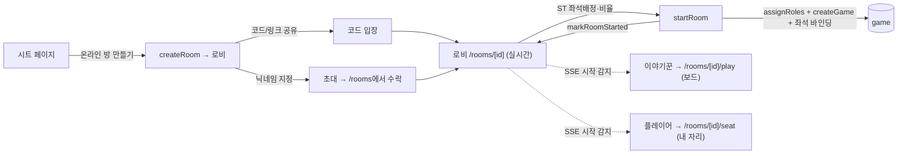
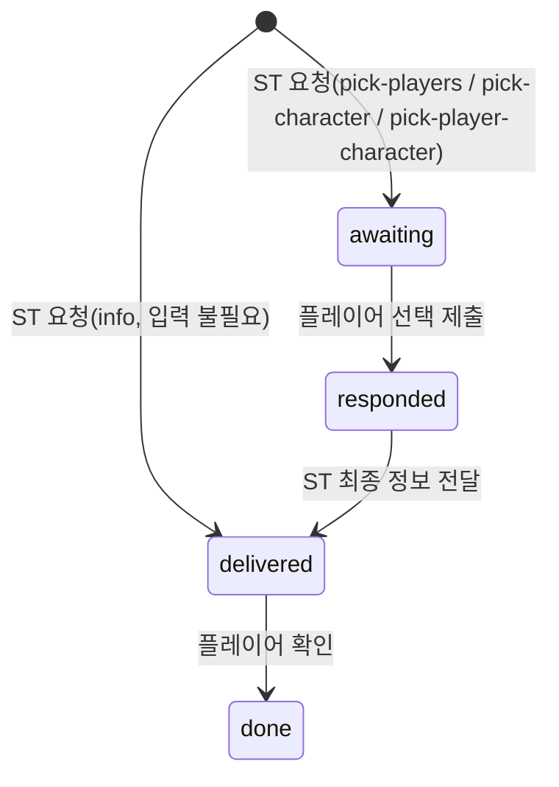

# 11 · 온라인 플레이 (룸·로비·실시간·분리·보안)

[← 인증·인가](10-auth.md) · [홈](README.md)

기존 LAN 그리모어(노트북 1대=서버, 같은 WiFi 폰) 위에 **원격 멀티플레이어**를 얹은 기능.
디스코드 등에서 음성으로 진행하고, 그리모어·자리·정보 전달은 여기서 **실시간**으로 한다.
음성은 미구현(디스코드 전제). 채팅은 전체 + 귓말(이야기꾼은 모든 귓말 열람).

> 핵심 원칙: **기존 진행(`/play`)·내역(`/games`)과 라우트를 분리**하되 컴포넌트(PlayCanvas·SeatView·
> GameReplay 등)는 재사용한다. 온라인 게임은 `/games` 내역에서 제외되고 `/rooms`에서 다룬다.

## 실시간 백본 (SSE) → [05](05-state-sync.md)

`lib/realtime.ts`의 인메모리 이벤트 버스를 게임/룸 채널로 일반화했다. 서버 액션이 변경 후
`emitGameUpdate`/`emitRoomUpdate`로 신호(rev)만 쏘고, SSE 라우트가 구독해 클라에 push한다.
진실 원천은 SQLite — 신호만 흘리므로 비밀이 버스로 새지 않는다.

- `app/api/games/[gameId]/stream` · `app/api/rooms/[roomId]/stream` — `text/event-stream`,
  `runtime=nodejs`. 구독→`update` push, keepalive, `req.signal.aborted` 즉시 정리(누수 방지).
- 클라: `components/useGameStream.ts`의 `useGameStream`/`useRoomStream`(EventSource, 자동 재연결).

## 데이터 모델 — `lib/rooms.ts` + `lib/games/schema.ts`

게임은 **시작 순간** 기존 `createGame`으로 만들어진다. 그 전 "로비"를 담는 게 룸이다.

| 테이블 | 내용 |
|---|---|
| `game_rooms` | `id, code(공유 입장코드), owner_id(이야기꾼), sheet_id, sheet_name, status(lobby/started/closed), game_id(시작 시 연결), config` |
| `game_room_members` | `(room_id, user_id) PK, nickname(스냅샷), role(storyteller/player/spectator), seat(배정좌석·null=관전), last_seen_at` |
| `game_invites` | `id(토큰), room_id, invited_user_id, status(pending/accepted/declined)` |

좌석↔계정 바인딩은 기존 `game_players.user_id`를 재사용한다(시작 시 멤버 좌석→게임 좌석).
`lib/rooms.ts`는 순수 CRUD + 초대만 담당하고, **시작 오케스트레이션은 액션**에 둔다.

## 흐름

- **생성**: 시트 상세 `SheetActions`의 "온라인 방 만들기"(이야기꾼·관리자) → `createRoomAction`.
- **입장(둘 다)**: 공유 입장코드(`joinRoomByCodeAction`) **그리고** 지정 초대(`sendInviteAction`→
  당사자가 `/rooms`에서 `acceptInviteAction`). 둘 다 멤버로 추가된다.
- **로비** `components/Lobby.tsx`: 이야기꾼은 초대·좌석배정·비율·시작, 플레이어는 대기·나가기.
  `useRoomStream`으로 실시간 갱신 + 하트비트. 시작되면 SSE로 각자 자기 화면으로 이동.
- **시작** `startRoomAction`: 좌석 배정 멤버를 좌석순 0..n-1로 재배치 → `assignRoles` → `createGame`
  (userId 바인딩) → `markRoomStarted`. 닉네임은 시작 시점 현재 계정 닉네임으로 채운다.

## 진행/내역 분리 (라우트)

| 온라인 | 대응 LAN(기존) | 비고 |
|---|---|---|
| `/rooms` | — | 내 방·받은 초대·코드 입장 |
| `/rooms/[roomId]` | — | 로비(대기실) |
| `/rooms/join/[code]` | — | 입장 링크 |
| `/rooms/[roomId]/play` | `/play/[gameId]` | 이야기꾼 보드(PlayCanvas/GameReplay 재사용) |
| `/rooms/[roomId]/seat` | `/play/[gameId]/seat` | 플레이어 자리(SeatView 재사용 + redaction) |

- `/play/[gameId]`·`/play/[gameId]/seat`는 룸이 있으면 `/rooms/...`로 리다이렉트(분리 강제).
- `/games` 내역은 `onlineGameIds()`로 온라인 게임을 제외한다.
- 온라인 게임 삭제 시 `deleteGameAction`이 연결 룸을 `closeRoom`해 고아 룸을 방지한다.

## 보안 — 좌석 redaction (핵심)

플레이어의 `/rooms/[roomId]/seat`은 `"use client"`(SeatView)에 데이터를 넘긴다. Next.js는 이 prop을
RSC/Flight payload로 **브라우저에 직렬화**하므로, 전체 `Game`을 그대로 넘기면 다른 좌석의 직업·진영,
블러핑, 위장 등 비밀이 네트워크 응답에 실린다(시계탑 비밀성 붕괴).

→ `lib/redact.ts`의 `redactGameForSeat(game, viewerSeat)`로 **서버에서** 본인 좌석만 진짜 정보로
남기고 그 외 좌석의 직업/진영/마커/메모, 게임 전역 비밀(`bluffs`·`actions`·`note`·`lunaticBluffs`·
`lunaticMinions`·`globalMarkers`·`votes`·`disguises`(본인 것만))을 모두 지운 뒤 넘긴다. 시트 직업도
본인 직업(+위장 대상)만 보낸다. 닉네임·좌석·생사 등 보드 공개 정보는 유지.

접근제어: 온라인 좌석 뷰는 **룸 멤버이면서 좌석 바인딩된 사람만**(관전자는 자리 정보 없음 안내).
LAN `/play/[gameId]/seat`은 의도된 신뢰 기반(같은 WiFi)이라 기존 동작 유지.

## 플레이어 마스킹 보드 — `components/PlayerGame.tsx`

온라인 플레이어의 메인 뷰(`/rooms/[roomId]/seat`)는 이야기꾼과 **같은 좌석 배치**를 보되 모든 토큰이
"?"(본인 좌석만 진짜 직업)다. 좌석을 눌러 **직업을 추측**(점선 링)하고 **메모**(📝)를 남기며, 좌석과
무관한 자유 메모도 있다. 모두 개인 기록(다른 사람에게 안 보임).

- 데이터: `game_player_guesses(game_id, user_id, target_seat, guess_character_id, note)` —
  `target_seat=-1`은 자유 메모. `lib/player-board.ts`가 upsert/조회. `setGuessAction`·`setSeatNoteAction`·
  `setGeneralMemoAction`(룸 멤버 가드, emit 없음 — 사적). 입력 길이 상한.
- 렌더: 페이지가 `redactGameForSeat`로 본인 외 좌석을 지운 게임 + **전체 스크립트 직업**(공개, 추측
  picker용 `RolePickerModal` 재사용)을 넘긴다. redacted players엔 좌석↔직업 매핑이 없으므로 전체 스크립트
  목록을 보내도 비밀이 새지 않는다. 토큰 좌표는 ST 보드와 동일한 `player.x/y`.
- 실시간: `useGameStream`으로 ST 변경(사망·이동 등)을 즉시 반영. 추측/메모는 로컬 즉시 + 액션 영속.

## 채팅(전체 + 귓말) — `components/ChatWidget.tsx`

룸 단위 채팅(로비~게임 같은 `room_id`로 이어짐). 플로팅 위젯이라 로비·플레이어·이야기꾼 보드
어디서나 같은 채팅을 띄운다. 작은 드로어 ↔ 화면 중앙 큰 모달 전환(크게 보기). 닫혀 있으면 미읽음 뱃지.

- 데이터: `game_messages(room_id, user_id, nickname, body, recipient_user_id, recipient_nickname, created_at)`.
  `recipient_user_id`가 있으면 **귓말**(없으면 전체). `getMessagesAction`·`sendChatAction(body, recipientUserId?)`
  (멤버, trim+1000자 캡, `emitRoomUpdate`). 닫힌 룸은 메시지도 정리.
- **귓말 가시성**: 플레이어는 전체 + 본인이 보내거나 받은 귓말만, **이야기꾼(방장)은 모든 귓말 열람**.
  `listMessages(roomId, viewerUserId, isOwner)`가 SQL로 필터 → 남의 귓말은 서버에서 아예 안 내려간다.
  받는 사람은 공통 `Select`로 전체/멤버 중 선택(`ChatWidget`에 members 전달).
- 전달: 룸 채널 SSE 재사용(`emitRoomUpdate` → 위젯이 `getMessagesAction` 재조회). 본문은 React 텍스트(XSS escape).
- 한글 등 IME 조합 중 Enter는 무시(`e.nativeEvent.isComposing`) — 조합 확정 Enter가 전송까지 일으켜
  "안녕"이 두 번 가던 버그 방지.

## 밤 행동 요청/응답 프로토콜 — `lib/night-requests.ts`

이야기꾼↔플레이어 실시간 핸드셰이크. 능력은 자동화하지 않고 ST가 좌석에 요청을 보내면 플레이어가
매칭 UI로 응답하고, ST가 응답을 보고 최종 정보를 전달한다.

- 데이터: `game_night_requests(id, game_id, seat, kind, prompt, max_targets, status, player_targets, player_choice, info_payload)`.
  좌석당 활성 1개(새 요청이 기존을 cancelled로 슈퍼시드). 액션: `createNightRequest`(ST)·`respond`(본인 좌석)·
  `deliver`(ST)·`acknowledge`(본인 좌석)·`cancel`(ST)·`getMyRequest`(본인)·`listNightRequests`(ST). 전부 `emitGameUpdate`.
- **보안**: 플레이어 좌석 페이지는 `getActiveForSeat(gameId, boundSeat)`로 **본인 좌석 요청만** 받는다.
  `info_payload`는 자기완결 표시 데이터(heading/subheading/roleTokens charId/nameTokens 닉네임)라 전체 게임이
  새지 않는다. respond/acknowledge는 `seatForUser===req.seat` 검사로 남의 좌석 요청을 못 건드린다.
- 행동 요청 종류(`kind`): `pick-players`(좌석 N개, `max_targets`로 개수) · `pick-character`(직업 1) ·
  `pick-player-character`(좌석 1 + 직업 1, 도박꾼류 — `player_targets[0]`=좌석, `player_choice`=직업).
- UI: 플레이어 `components/NightRequestPanel.tsx`(좌석 그리드/`RolePickerModal`/정보 표시+확인) ·
  이야기꾼 `components/NightConsole.tsx`(플로팅 — 종류별 요청·응답 확인·`InfoComposer`로 정보 작성·전달).
- 기록: `listAllForGame`/`listAllForSeat` + `listNightRequestHistory`(ST)/`getMyRequestHistory`(플레이어).
  공용 `components/NightHistoryList.tsx`로 요청·응답·전달 정보를 최근순 표시. NightConsole은 **진행/기록 탭**으로
  분리(요청이 쌓여도 새 정보와 안 섞임), 플레이어는 '기록' 버튼+모달로 받은 정보를 다시 본다.

## 공통 모달 — `components/Modal.tsx`

가운데 모달은 **백드롭 클릭·Esc·모바일 뒤로가기(`useBackClose`)**로 일관되게 닫힌다(내부 패널은
클릭 전파를 막아 내용 클릭으로는 안 닫힘, body로 portal). 채팅 확대·기록 모달이 이걸 쓴다.
`NightRequestPanel`은 강제 응답 모달이라 닫기 대신 *접기*(FAB로 재오픈)로 동작하되 같은 트리거(바깥클릭·Esc·뒤로가기)를 받는다.
`RolePickerModal`·좌석 메모 패널은 자체적으로 같은 동작을 갖춘다.

## 주요 파일

- `lib/realtime.ts` 이벤트 버스(게임/룸 채널) · `lib/rooms.ts` 룸 데이터 레이어 ·
  `lib/role-assign.ts` 직업 배정(게임/룸 시작 공유) · `lib/redact.ts` 좌석 redaction ·
  `lib/player-board.ts` 추측/메모 · `lib/chat.ts` 전체 채팅 · `lib/night-requests.ts` 밤 행동 요청.
- `app/rooms/actions.ts` 룸 서버 액션 · `app/rooms/**` 룸/로비/입장/진행/자리 페이지.
- `components/Lobby.tsx` · `RoomsHome.tsx` · `JoinConfirm.tsx` · `PlayerGame.tsx` ·
  `ChatWidget.tsx` · `NightRequestPanel.tsx` · `NightConsole.tsx` · `NightHistoryList.tsx` · `useGameStream.ts`.
- 공통 UI: `components/Select.tsx`(드롭다운, native `<select>` 대체) · `components/Modal.tsx`(가운데 모달 일관 닫기) ·
  `PlayerPicker`/`RolePickerModal`(좌석·직업 토큰 picker). 네이티브 폼 요소를 앱 톤으로 대체하는 공통 컴포넌트들.

## 다듬을 거리

- ST 콘솔 정보 작성 프리셋(직업별 ActionSpec 자동),
  이야기꾼 보드 SSE 구독(플레이어발 변경 즉시 반영 — 현재는 콘솔/위젯만 구독).
- 이야기꾼 보드(PlayCanvas)는 아직 SSE 미구독 — 플레이어발 변경을 ST가 봐야 하는 요청/응답 단계에서
  `getGameAction` refetch+`setGame`을 붙인다.

---
[← 인증·인가](10-auth.md) · [홈](README.md)
