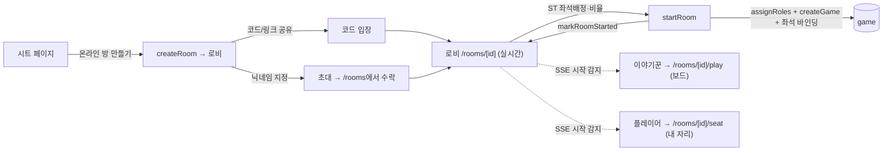
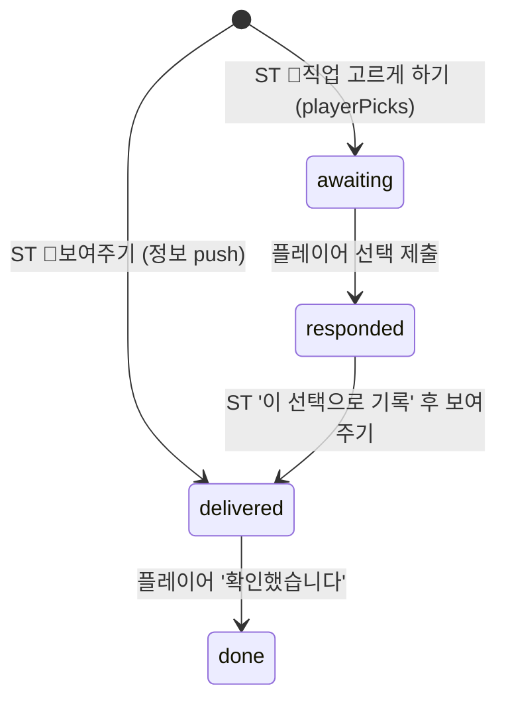
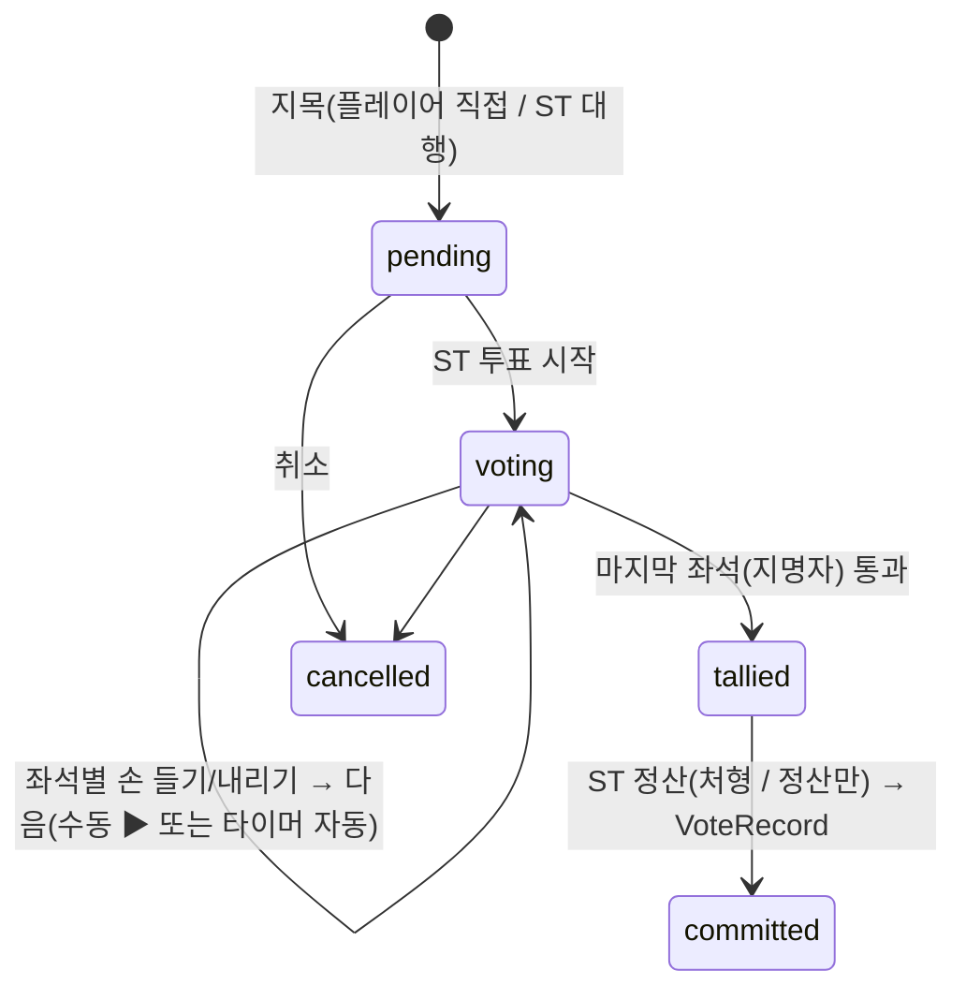

# 11 · 온라인 플레이 (룸·로비·실시간·분리·보안)

[← 인증·인가](10-auth.md) · [홈](README.md)

기존 LAN 그리모어(노트북 1대=서버, 같은 WiFi 폰) 위에 **원격 멀티플레이어**를 얹은 기능.
디스코드 등에서 음성으로 진행하고, 그리모어·자리·정보 전달은 여기서 **실시간**으로 한다.
음성은 미구현(디스코드 전제). 채팅은 전체 + 귓말(이야기꾼은 모든 귓말 열람).

> 핵심 원칙: **기존 진행(`/play`)·내역(`/games`)과 라우트를 분리**하되 컴포넌트(PlayCanvas·SeatView·
> GameReplay 등)는 재사용한다. 온라인 게임은 `/games` 내역에서 제외되고 `/rooms`에서 다룬다.

## 실시간 백본 (SSE) → [05](05-state-sync.md)

`lib/realtime.ts`의 인메모리 이벤트 버스를 게임/룸 채널로 일반화했다. 서버 액션이 변경 후
`emitGameUpdate`/`emitRoomUpdate`로 신호(rev)만 쏘고, SSE 라우트가 구독해 클라에 push한다.
진실 원천은 SQLite — 신호만 흘리므로 비밀이 버스로 새지 않는다.

- `app/api/games/[gameId]/stream` · `app/api/rooms/[roomId]/stream` — `text/event-stream`,
  `runtime=nodejs`. 구독→`update` push, keepalive, `req.signal.aborted` 즉시 정리(누수 방지).
- 클라: `components/useGameStream.ts`의 `useGameStream`/`useRoomStream`(EventSource, 자동 재연결).

## 데이터 모델 — `lib/rooms.ts` + `lib/games/schema.ts`

게임은 **시작 순간** 기존 `createGame`으로 만들어진다. 그 전 "로비"를 담는 게 룸이다.

| 테이블 | 내용 |
|---|---|
| `game_rooms` | `id, code(공유 입장코드), owner_id(이야기꾼), sheet_id, sheet_name, status(lobby/started/closed), game_id(시작 시 연결), config` |
| `game_room_members` | `(room_id, user_id) PK, nickname(스냅샷), role(storyteller/player/spectator), seat(배정좌석·null=관전), last_seen_at` |
| `game_invites` | `id(토큰), room_id, invited_user_id, status(pending/accepted/declined)` |

좌석↔계정 바인딩은 기존 `game_players.user_id`를 재사용한다(시작 시 멤버 좌석→게임 좌석).
`lib/rooms.ts`는 순수 CRUD + 초대만 담당하고, **시작 오케스트레이션은 액션**에 둔다.

## 흐름

- **생성**: 시트 상세 `SheetActions`의 "온라인 방 만들기"(이야기꾼·관리자) → `createRoomAction`.
- **입장(둘 다)**: 공유 입장코드(`joinRoomByCodeAction`) **그리고** 지정 초대(`sendInviteAction`→
  당사자가 `/rooms`에서 `acceptInviteAction`). 둘 다 멤버로 추가된다.
- **로비** `components/Lobby.tsx`: 이야기꾼은 초대·좌석배정·비율·시작, 플레이어는 대기·나가기.
  `useRoomStream`으로 실시간 갱신 + 하트비트. 시작되면 SSE로 각자 자기 화면으로 이동.
- **시작** `startRoomAction`: 좌석 배정 멤버를 좌석순 0..n-1로 재배치 → `assignRoles` → `createGame`
  (userId 바인딩) → `markRoomStarted`. 닉네임은 시작 시점 현재 계정 닉네임으로 채운다.

## 진행/내역 분리 (라우트)

| 온라인 | 대응 LAN(기존) | 비고 |
|---|---|---|
| `/rooms` | — | 내 방·받은 초대·코드 입장 |
| `/rooms/[roomId]` | — | 로비(대기실) |
| `/rooms/join/[code]` | — | 입장 링크 |
| `/rooms/[roomId]/play` | `/play/[gameId]` | 이야기꾼 보드(PlayCanvas/GameReplay 재사용) |
| `/rooms/[roomId]/seat` | `/play/[gameId]/seat` | 플레이어 자리(SeatView 재사용 + redaction) |

- `/play/[gameId]`·`/play/[gameId]/seat`는 룸이 있으면 `/rooms/...`로 리다이렉트(분리 강제).
- `/games` 내역은 `onlineGameIds()`로 온라인 게임을 제외한다.
- 온라인 게임 삭제 시 `deleteGameAction`이 연결 룸을 `closeRoom`해 고아 룸을 방지한다.

## 보안 — 좌석 redaction (핵심)

플레이어의 `/rooms/[roomId]/seat`은 `"use client"`(SeatView)에 데이터를 넘긴다. Next.js는 이 prop을
RSC/Flight payload로 **브라우저에 직렬화**하므로, 전체 `Game`을 그대로 넘기면 다른 좌석의 직업·진영,
블러핑, 위장 등 비밀이 네트워크 응답에 실린다(시계탑 비밀성 붕괴).

→ `lib/redact.ts`의 `redactGameForSeat(game, viewerSeat)`로 **서버에서** 본인 좌석만 진짜 정보로
남기고 그 외 좌석의 직업/진영/마커/메모, 게임 전역 비밀(`bluffs`·`actions`·`note`·`lunaticBluffs`·
`lunaticMinions`·`globalMarkers`·`votes`·`disguises`(본인 것만))을 모두 지운 뒤 넘긴다. 시트 직업도
본인 직업(+위장 대상)만 보낸다. 닉네임·좌석·생사 등 보드 공개 정보는 유지.

접근제어: 온라인 좌석 뷰는 **룸 멤버이면서 좌석 바인딩된 사람만**(관전자는 자리 정보 없음 안내).
LAN `/play/[gameId]/seat`은 의도된 신뢰 기반(같은 WiFi)이라 기존 동작 유지.

## 플레이어 마스킹 보드 — `components/PlayerGame.tsx`

온라인 플레이어의 메인 뷰(`/rooms/[roomId]/seat`)는 이야기꾼과 **같은 좌석 배치**를 보되 모든 토큰이
"?"(본인 좌석만 진짜 직업)다. 좌석을 눌러 **직업을 추측**(점선 링)하고 **메모**(📝)를 남기며, 좌석과
무관한 자유 메모도 있다. 모두 개인 기록(다른 사람에게 안 보임).

- **반응형 레이아웃**: 데스크탑(`lg`+)은 보드(좌, `flex-1`·정사각 `self-start`) + 우측 사이드바(`w-80`)로 2열.
  사이드바는 두 섹션 — **스크립트 직업 목록**(팀별 그룹, `shrink-0`·자체 스크롤, 클릭 → `AbilityModal` 상세) +
  **자유 메모**(`flex-1`, 많이 쓸 수 있게 크게). 모바일은 세로 스택(보드 → 스크립트 → 메모).
  스크립트 목록은 **전체 공개 스크립트**를 그대로 보여주되 인플레이 여부는 표시하지 않는다(어떤 직업이 실제로
  들어갔는지는 비밀 — 좌석↔직업 매핑을 안 주는 것과 같은 이유).

- 데이터: `game_player_guesses(game_id, user_id, target_seat, guess_character_id, note)` —
  `target_seat=-1`은 자유 메모. `lib/player-board.ts`가 upsert/조회. `setGuessAction`·`setSeatNoteAction`·
  `setGeneralMemoAction`(룸 멤버 가드, emit 없음 — 사적). 입력 길이 상한.
- 렌더: 페이지가 `redactGameForSeat`로 본인 외 좌석을 지운 게임 + **전체 스크립트 직업**(공개, 추측
  picker용 `RolePickerModal` 재사용)을 넘긴다. redacted players엔 좌석↔직업 매핑이 없으므로 전체 스크립트
  목록을 보내도 비밀이 새지 않는다. 토큰 좌표는 ST 보드와 동일한 `player.x/y`.
- 실시간: `useGameStream`으로 ST 변경(사망·이동 등)을 즉시 반영. 추측/메모는 로컬 즉시 + 액션 영속.

## 채팅(전체 + 귓말) — `components/ChatWidget.tsx`

룸 단위 채팅(로비~게임 같은 `room_id`로 이어짐). 플로팅 위젯이라 로비·플레이어·이야기꾼 보드
어디서나 같은 채팅을 띄운다. **작은 드로어**(단일 스트림 + 받는 사람 Select)와 **크게 보기(분할 뷰)**를
전환한다. 닫혀 있으면 미읽음 뱃지.

- 데이터: `game_messages(room_id, user_id, nickname, body, recipient_user_id, recipient_nickname, created_at)`.
  `recipient_user_id`가 있으면 **귓말**(없으면 전체). `getMessagesAction`·`sendChatAction(body, recipientUserId?)`
  (멤버, trim+1000자 캡, `emitRoomUpdate`). 닫힌 룸은 메시지도 정리.
- **귓말 가시성**: 플레이어는 전체 + 본인이 보내거나 받은 귓말만, **이야기꾼(방장)은 모든 귓말 열람**.
  `listMessages(roomId, viewerUserId, isOwner)`가 SQL로 필터 → 남의 귓말은 서버에서 아예 안 내려간다.
  받는 사람은 공통 `Select`로 전체/멤버 중 선택(`ChatWidget`에 members 전달).
- **분할 뷰(크게 보기)**: 전체화면은 좌측 **대화 목록**(전체 채팅 + 멤버별 귓말 스레드, 최대 14명 —
  미읽음 배지·마지막 메시지 미리보기·최근 대화순, **닉네임 색 텍스트**로 구분) + 우측 **선택 스레드**로 나뉜다.
  특정 유저와의 귓말만 따로 본다. 스레드 그룹핑은 **클라 측**(전체=`recipient` null, 멤버 X=X가 발신/수신인
  귓말 — 플레이어는 나↔X, 이야기꾼은 X가 낀 모든 귓말)이라 DB/서버 무변경. 미읽음 기준선은 최초 로드 시점 id,
  스레드 진입/이탈 시 읽음 처리(`seen[key]`). 모바일은 목록↔대화 **마스터-디테일**(`← 목록`). 드로어(작게)는 단일 스트림 유지.
- **상대별 하위 필터(이야기꾼)**: 이야기꾼은 멤버 X의 스레드에서 X가 낀 모든 귓말이 섞여 보기 힘드므로,
  스레드 안에 **상대 chip**(전체/각 상대)을 둬 X↔특정 상대(Y) 귓말만 좁혀 본다. 상대가 2명 이상일 때만
  노출(플레이어는 나↔X뿐이라 안 뜸). `otherParty(m, X)`로 각 귓말의 상대편을 뽑아 distinct 집계·필터.
- 전달: 룸 채널 SSE 재사용(`emitRoomUpdate` → 위젯이 `getMessagesAction` 재조회). 본문은 React 텍스트(XSS escape).
- 한글 등 IME 조합 중 Enter는 무시(`e.nativeEvent.isComposing`) — 조합 확정 Enter가 전송까지 일으켜
  "안녕"이 두 번 가던 버그 방지.
- **밤 잠금**: `phase==='night'`이면 채팅 전송 불가(읽기는 됨). ChatWidget `locked` prop으로 입력·전송 비활성 +
  "🌙 밤에는 대화할 수 없습니다" 안내, `sendChatAction`도 **서버에서 밤 거부**(클라 우회 차단). 로비·낮·종료는 허용.

## 플레이어 닉네임 구분 색 — `lib/player-colors.ts`

이야기꾼이 채팅·보드에서 플레이어를 색으로 구분하기 위한 장치(화면만 보고 누가 누군지 헷갈리는 문제).
서로 잘 구분되는 **15색 팔레트**(색상환 + 갈색·회색, 어두운 배경 가독)를 `lib/player-colors.ts`(순수)에 두고
`colorHex(id, fallbackKey)`로 해석한다(미지정이면 fallbackKey로 결정론 폴백 — 항상 어떤 색은 나옴).

- **저장·배정**: 멤버 단위(`game_room_members.color`, 색 id). 방 입장(`createRoom`/`addMember`) 시
  `pickUnusedColor`로 **방에서 안 쓴 색 중 랜덤**(distinct) 배정. 레거시(빈 값) 멤버는 표시 시 userId 기반 폴백.
- **ST 수정**: `setMemberColorAction`(방장만) → `setMemberColor` + emit. 채팅 사이드바(크게 보기)의 멤버 옆
  색 버튼 → 15색 스와치 팝오버로 변경. 낙관적 로컬 반영 + 저장 + `router.refresh`로 보드까지 동기화.
- **적용**: 채팅은 `memberColors`(userId→id)로 메시지 라벨의 **발신자·수신자 이름 각각**과 대화 목록 **이름**을 색칠
  (색 원형 아바타·색 점은 제거 — 이름 색으로 충분. ST 색 편집은 목록 행 우측 '색' 버튼 → 15색 팝오버)
  ([ChatWidget](../../components/ChatWidget.tsx)). 보드는 `seatColors`(seat→hex, 페이지가 `room.members`의 seat·color로 계산)로
  좌석 닉네임 라벨을 색칠([PlayCanvas](../../components/PlayCanvas.tsx) ST 보드 · [PlayerGame](../../components/PlayerGame.tsx) 플레이어 보드).
  LAN 게임은 룸이 없어 색 맵이 비고 → 기존 기본색(추가 부담 0).

## 낮 타이머(플레이어 표시) — `components/DayTimers.tsx`

이야기꾼이 시작한 밀담/공개토론 타이머([TimerPanel](../../components/TimerPanel.tsx))를 플레이어도 본다.
`game.phaseTimers`는 공개 정보라 redaction에서 보존되므로(strip 목록에 없음) 좌석 뷰가 그대로 받아
`DayTimers`가 **진행 중인** 타이머만 헤더 아래 **sticky pill**로 카운트다운 표시한다(제어는 ST 전용, 플레이어는
읽기만). 진행 중이 없으면 숨고, 밤 전환 시 새 스냅샷 타이머가 비어 자동으로 사라진다. `startedAt`(서버 ms)
기준 클라 시계로 남은 시간 계산(TimerPanel과 동일 모델). 보드를 안 가리는 상단 중앙 위치.

## 밤·낮 행동 보여주기 — 순서 패널 push · `lib/showcase.ts`

온라인 ST는 **오프라인과 같은 행동 순서 사이드바**([NightSidebar](../../components/NightSidebar.tsx)/[DaySidebar](../../components/DaySidebar.tsx)
— `PlayCanvas`가 LAN·온라인 공유)로 밤/낮 능력을 운영한다. LAN에선 "보여주기"가 새 창 풀스크린(`/play/[id]/show/[seat]`)으로
열려 ST가 폰을 들이미는데, **온라인(`online` 컨텍스트 주입)에선 같은 버튼이 결과를 그 플레이어 폰으로 push**한다.
과거의 수동 빌더(`NightConsole` — 좌석 드롭다운·heading/토큰 손입력)는 **제거**했다. 순서 패널이 유일한 도구다.

- **정보 직업**(공감자·세탁부 등): 행에서 대상 버튼 선택 + 자동추천 결과 → 저장 → **📲 보여주기** → 그 좌석 폰에
  showcase가 뜨고 → **확인했습니다** → 행이 "✓ 플레이어 확인함".
- **직접 선택 직업**(`playerPicks` — 철학자·도박꾼·세레노버스): **📲 직업 고르게 하기** → 폰에 직업/좌석 picker →
  제출 → 행에 선택 인라인 표시 → "이 선택으로 기록" → 보여주기.
- **첫밤 정보**(하수인/악마): 정보 노드에서 수신자별 **한 화면 합본**을 push — 하수인은 "동료 하수인 + 악마",
  악마는 "하수인 + 블러핑 3개"를 한 번에 받는다(1회 기상 = 화면 1개). 노드마다 수신자당 버튼 하나("정보 보내기")라
  과거의 블러핑/하수인/악마 정보 개별 버튼 혼동이 없다. `resolveShowcase`의 `minion-info`/`demon-info` 모드 → `firstNightInfo` payload.

핵심 — **단일 출처**:
- [lib/showcase.ts](../../lib/showcase.ts) `resolveShowcase(game, seat, {as,variant,mode}, getTeam)` → `ShowcasePayload`
  (discriminated: `standard`/`roleTokens`/`nameTokens`/`firstNightInfo`). **LAN show 페이지와 온라인 push가 같은 함수**로
  "무엇을 드러낼지"를 계산해 두 경로가 갈라지지 않는다. show 페이지의 특수 모드(demon/bluffs/minions/lunatic-*)도 여기로 옮겼다.
- [components/ShowcasePayloadView.tsx](../../components/ShowcasePayloadView.tsx)가 payload를 그린다 — **LAN show
  페이지·온라인 `NightRequestPanel`·능력 미리보기가 같은 렌더러**(표준은 기존 `ShowcaseView` 재사용). 알 수 없는/
  레거시(구 InfoPayload) payload는 뷰·요약(`showcaseSummary`)이 방어적으로 폴백(막힌 화면 방지).
- **보안**: payload는 *능력이 정당하게 드러내는 것*만 담는다 — 이름만 슬롯(점쟁이·귀족 등)은 닉네임만, 정체 슬롯
  (target/targets)만 characterId. 다른 좌석 직업이 새지 않는다(좌석 redaction과 동형·자기완결).

전송 인프라 — 기존 [lib/night-requests.ts](../../lib/night-requests.ts) 재사용:
- `game_night_requests(...)`의 `info_payload`가 이제 `ShowcasePayload`를 담는다(**스키마 무변경**, JSON 재활용).
  좌석당 활성 1개(새 요청이 기존을 cancelled로 슈퍼시드).
- 액션([app/rooms/actions.ts](../../app/rooms/actions.ts)): `pushShowcaseAction(roomId, seat, characterId, {variant,mode,toSeat})`
  (resolve→`createRequest`로 delivered 즉시 생성) · `requestPlayerPickAction`(spec→`pick-character`/`pick-player-character`)
  · 기존 `respond`/`acknowledge`/`cancel` 재사용. 전부 `emitGameUpdate`.
- 온라인 컨텍스트: `PlayCanvas`가 `online={{roomId}}`면 `listNightRequestsAction`로 좌석별 요청을 조회(게임 SSE로 갱신)해
  `OnlineNightCtx`를 사이드바→[NightActionRow](../../components/NightActionRow.tsx)에 내려, 보여주기/직업목록을 push 버튼으로
  바꾸고 전송·응답·확인 상태를 행에 인라인 표시. `recordActionAction`(행동 기록)은 LAN과 공유.
- **상태 뱃지**([RequestStatusBadge](../../components/RequestStatusBadge.tsx)): ST가 "내가 보냈는지"와 "플레이어가 확인했는지"를
  **색 알약**으로 구분 — "전송함·확인 대기"(amber) → "✓ 확인함"(green). 선택 요청은 "선택 대기 중"(muted) → "응답 옴"(gold).
  행·정보 노드 공용. 요청이 있으면 push 버튼은 "다시 보내기"로 바뀐다. 플레이어 확인(acknowledge)이 게임 SSE로 ST 뱃지를 green으로 갱신.
  (톤앤매너: 컬러 이모지 대신 색·텍스트로 위계를 주고, 확인 체크만 `✓`(모노크롬)을 쓴다.)
- 플레이어 [components/NightRequestPanel.tsx](../../components/NightRequestPanel.tsx): delivered면 `ShowcasePayloadView`로
  1:1 렌더 + '확인했습니다', awaiting이면 좌석/직업 picker. **본인 좌석 요청만**(`getActiveForSeat`), respond/ack는
  `seatForUser===req.seat` 검사.
- **recipient 라우팅**: showcase의 recipient가 `actor`→본인 좌석, `target`→첫 지목 좌석(세레노버스·마귀할멈),
  `none`→ST가 받는 좌석을 직접 지정(마술사·꼭두각시·미치광이 가짜 공격 — 데몬에게 보여줌).
- 기록 열람: `components/NightHistoryList.tsx`(`showcaseSummary`로 요약), 플레이어 '기록' 버튼.

## 낮 지목·투표 (시계바늘 순차) — `lib/nominations.ts`

낮의 지목→공개 투표→처형. 밤 행동이 좌석 단위 핸드셰이크라면, 이건 **게임 단위 순차 스윕**이다.
핵심은 **2층 구조**다.

- **라이브 레이어**(신규, 임시·per-day): 지목과 시계바늘 투표가 진행되는 동안의 상태(`game_nominations` +
  `game_nomination_hands`). 투표는 **공개 정보**라 redaction 대상이 아니다 — 누가 손을 들었는지 전원에게 보인다.
- **committed 레이어**(기존 불변): ST가 스윕 종료 후 정산하면 라이브 찬성표를 기존 `recordVote`로 `VoteRecord`에
  확정한다. 복기·언더테이커·식인귀는 이 committed만 본다 → 기존 로직 무변경.

- **순서**: 지명자 **다음 좌석부터 시계방향**(좌석 인덱스 순환), 마지막이 지명자 본인. 좌석 인덱스가 곧
  시계방향이다([seat-layout.ts](../../lib/seat-layout.ts) `circlePositions`). 투표 불가 좌석(죽었고 유령표 없음)은 스킵.
- **지목 주체**: 플레이어가 자기 화면에서 직접(`nominateAction`) **또는** ST 대행(`openNominationOnBehalfAction`).
  하루 1회·생존자만·활성 지목 1개 제한은 **서버에서 강제**(LAN VotesSidebar는 클라만 검사 — 온라인은 신뢰 불가라 필수).
- **자기 차례에만 손**: `castHandAction`은 `seatForUser===nomination.order[pointer]`인 좌석만 허용(밤요청
  `seatForUser===req.seat`과 동형). 죽은 좌석은 `ghostVoteUsed`가 남아있을 때만 up.
- **진행(advance)**: `pointer`를 다음으로 옮기며 현재 좌석 손을 확정한다. **`step` CAS**로 중복 호출을 무해화
  (자동 타이머와 수동이 겹쳐도 안전). 유령표 up이 확정되면 그 좌석의 `game_players.ghost_vote_used`를 소모한다.
- **페이싱**: 기본 ST 수동(`▶다음`). `per_seat_sec>0`이면 좌석당 카운트다운 + 만료 시 자동 advance —
  [useAutoAdvance](../../components/useAutoAdvance.ts)를 **ST 클라(주)·현재 투표자 클라(보조)**가 돌린다(CAS로 중복 무해).
- **정산**: `commitNominationAction`이 `countUp`→`recordVote({nominator,nominee,votes,executed})` + executed면
  `setStatus(nominee,'dead','execution')`(=LAN `recordVoteAction` 본체 재사용) + `captureUndo`. 처형 사망을
  ST 보드(PlayCanvas)에 반영하려 DayConsole이 정산 뒤 `router.refresh`.
- **정산 규칙 공유**: 처형선(생존 과반)·최다·동률 계산은 [lib/voting.ts](../../lib/voting.ts) `computeTally`로 추출해
  LAN `VotesSidebar`와 온라인 `DayConsole`이 함께 쓴다(규칙 분기 방지).
- **UI**: 플레이어 [components/DayVotePanel.tsx](../../components/DayVotePanel.tsx)(내 차례=강제 모달 손들기/내리기+카운트다운,
  남의 차례=하단 배너 관전, 지목 가능하면 "지목하기"), ST [components/DayConsole.tsx](../../components/DayConsole.tsx)(플로팅 —
  대행 지목·시작/일시정지/다음/속도/취소·정산/처형). 활성 지목은 게임 SSE로 refetch(액션 기반, PlayCanvas 낙관 상태 보존).
- **phase 게이팅**: 지목/투표/정산 모두 `phase==='day'`에서만. `getActive`는 `day===game.day`만(오래된 지목 격리),
  새 지목 생성 시 이전 낮의 미커밋 지목을 `cancelStale`로 정리. 밤 전환 시 플레이어 패널은 자동 소멸.

## 공통 모달 — `components/Modal.tsx`

가운데 모달은 **백드롭 클릭·Esc·모바일 뒤로가기(`useBackClose`)**로 일관되게 닫힌다(내부 패널은
클릭 전파를 막아 내용 클릭으로는 안 닫힘, body로 portal). 채팅 확대·기록 모달이 이걸 쓴다.
`NightRequestPanel`은 강제 응답 모달이라 닫기 대신 *접기*(FAB로 재오픈)로 동작하되 같은 트리거(바깥클릭·Esc·뒤로가기)를 받는다.
`RolePickerModal`·좌석 메모 패널은 자체적으로 같은 동작을 갖춘다.

## 주요 파일

- `lib/realtime.ts` 이벤트 버스(게임/룸 채널) · `lib/rooms.ts` 룸 데이터 레이어 ·
  `lib/role-assign.ts` 직업 배정(게임/룸 시작 공유) · `lib/redact.ts` 좌석 redaction ·
  `lib/player-board.ts` 추측/메모 · `lib/chat.ts` 전체 채팅 · `lib/night-requests.ts` 밤 행동 요청(전송 인프라) ·
  `lib/showcase.ts` 보여주기 해석(LAN·온라인 단일 출처) ·
  `lib/nominations.ts` 낮 지목/투표(시계바늘 순차) · `lib/voting.ts` 정산 계산(LAN·온라인 공유) ·
  `lib/player-colors.ts` 닉네임 구분 15색(채팅·보드).
- `app/rooms/actions.ts` 룸 서버 액션 · `app/rooms/**` 룸/로비/입장/진행/자리 페이지.
- `components/Lobby.tsx` · `RoomsHome.tsx` · `JoinConfirm.tsx` · `PlayerGame.tsx` ·
  `ChatWidget.tsx` · `NightRequestPanel.tsx` · `NightHistoryList.tsx` · `ShowcasePayloadView.tsx`(보여주기 렌더) ·
  `RequestStatusBadge.tsx`(전송/확인 상태 뱃지) ·
  `DayVotePanel.tsx`(플레이어 투표) · `DayConsole.tsx`(ST 투표 콘솔) · `DayTimers.tsx`(플레이어 타이머) ·
  `useGameStream.ts` · `useAutoAdvance.ts`.
- LAN·온라인 공유: `components/NightSidebar.tsx`/`DaySidebar.tsx`/`NightActionRow.tsx`(`online` 컨텍스트로 보여주기 push) ·
  `components/ShowcaseView.tsx`(표준 보여주기 본문) · `app/play/[gameId]/show/[seat]`(LAN 풀스크린).
- 공통 UI: `components/Select.tsx`(드롭다운, native `<select>` 대체) · `components/Modal.tsx`(가운데 모달 일관 닫기) ·
  `components/RoomRedirect.tsx`(클라이언트 라우트 교체) ·
  `PlayerPicker`/`RolePickerModal`(좌석·직업 토큰 picker). 네이티브 폼 요소를 앱 톤으로 대체하는 공통 컴포넌트들.

## 라우팅 함정 — 서버 redirect()와 소프트 네비게이션

**프리페치된 `<Link>`가 가리키는 라우트에서 서버 `redirect()`를 호출하면 클라이언트 소프트 네비게이션에서 무한 진동한다**
(예: `/rooms/[id]` → `redirect('/play')` 이 `/rooms/[id]` ↔ `/play`를 ~70ms마다 `replaceState`로 핑퐁, 새로고침 전까지 안 멈춤).
하드 로드는 HTTP 307이라 정상이라 "새로고침하면 괜찮은" 형태로 나타난다. 두 갈래로 막는다:
- **링크는 최종 목적지로 직접**: `RoomsHome`은 시작된 방을 `/rooms/[id]`가 아니라 `/rooms/[id]/play`(이야기꾼)·`/seat`(플레이어)로 링크.
- **불가피한 분기는 클라이언트 replace**: `/rooms/[roomId]`의 started 분기는 서버 `redirect()` 대신 `RoomRedirect`(`router.replace`)로 우회.
  목록 스냅샷이 lobby→started 전환을 못 따라가 옛 링크를 누르는 경우까지 방어.

**공유 LAN 화면의 백링크도 같은 함정**: 온라인 ST 보드는 LAN 컴포넌트(`PlayCanvas`·보여주기·직업선택)를 재사용하고,
보여주기는 LAN 라우트 `/play/[gameId]/show/[seat]`(직업선택은 `/pick/[seat]`)로 간다. 거기 "← 그리모어"가 LAN 그리모어
`/play/[gameId]`를 가리키는데, **온라인 게임이면 `/play/[gameId]`가 서버 `redirect()`로 `/rooms/[id]/play`로 보내** 같은 진동이 난다.
→ show/pick 페이지는 `getRoomByGameId`로 온라인 여부를 보고 백링크를 `/rooms/[id]/play`로 **직접** 건다(LAN이면 `/play/[id]`).
추가로 `/play/[gameId]`·`/play/[gameId]/seat`의 온라인 redirect도 `RoomRedirect`로 우회(이중 방어).
배경: **온라인 방을 시작하면 `createGame`으로 실제 Game 레코드가 만들어지고 LAN 라우트 `/play/[gameId]`로도 존재한다** — 보드/보여주기 UI를 LAN과 공유하는 게 이 클래스의 근원.

## 다듬을 거리

- 이야기꾼 보드(PlayCanvas)의 SSE 구독은 **밤 행동 요청**(`listNightRequestsAction` refetch)·낮 `DayConsole`까지 왔다.
  낮 처형 정산 뒤 `DayConsole`이 `router.refresh`로 보드에 사망을 반영한다. 그 외 플레이어발 변경(예: 투표 진행)을
  PlayCanvas 토큰에 즉시 반영하려면 `getGameAction` refetch+`setGame`을 붙인다.
- 밤 행동 push 후속: `recipient:none` 좌석 지정을 seat picker 대신 자동 추론(마술사·꼭두각시 등 소수 케이스),
  push 실패/오프라인 플레이어에 대한 재전송 표시.
- 낮 투표 후속: 여행자 추방(exile) 별도 UI, 투표 로그의 복기 타임라인 통합, 낮 토론 타이머(PhaseTimers) 연동.

---
[← 인증·인가](10-auth.md) · [홈](README.md)
