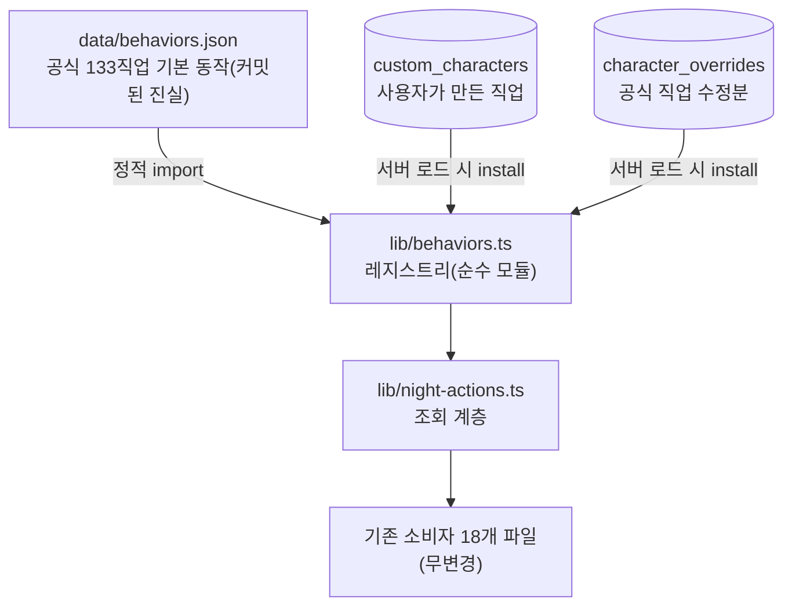

# 12 · 커스텀 직업 · 동작 레지스트리

[← 온라인 플레이](11-online-play.md) · [홈](README.md)

직업이 그리모어에서 "어떻게 작동하는가"는 예전엔 [lib/night-actions.ts](../../lib/night-actions.ts)의
`Record` 상수에 하드코딩돼 있었다. 직업을 하나 추가하려면 소스를 고치고 배포해야 했다.
지금은 **동작이 데이터**이고, UI에서 조합해 새 직업을 만들 수 있다.

## 핵심: 동작을 3층으로 분리



| 층 | 무엇 | 어디 |
|---|---|---|
| BASE | 공식 133직업 기본 동작 | [data/behaviors.json](../../data/behaviors.json) — 클라 번들에 정적 포함 |
| OVERLAY | 커스텀 직업 + 공식 직업 수정분 | `custom_characters` · `character_overrides` 테이블 |
| 폴백 | 미등재 직업 | `{ targets:1, result:"text" }` 자유 입력 |

id 공간이 갈려 있어(공식=고정 id, 커스텀=`x-` 접두 uuid) 전역 병합이 충돌하지 않는다.
이게 레지스트리를 프로세스 전역 단일 맵으로 둘 수 있는 근거다.

## CharacterBehavior — 조합 가능한 축

[lib/behaviors.ts](../../lib/behaviors.ts)가 타입의 단일 출처다.

```ts
type CharacterBehavior = {
  night?: ActionSpec;        // 첫밤(및 기본)
  otherNight?: ActionSpec;   // 그 외 밤 오버라이드 — 없으면 night로 폴백
  day?: ActionSpec;          // 낮 능력
  criteria?: string;         // ST 판정 기준 한 줄(순서표에 표시)
  misregister?: "good-as-evil" | "evil-as-good";  // 은둔자·첩자류 트랩
  stChoosesTargets?: boolean;   // 대상을 ST가 고름(플레이어 폰 선택 안 띄움)
  roleChange?: boolean;         // 결과 직업으로 대상 좌석을 실제 변경
  gainResultAbility?: boolean;  // 결과 직업 능력을 본인이 획득(철학자)
  showsWithoutRecord?: boolean; // 기록 없이도 보여주기 노출(마술사·꼭두각시)
};
```

`ActionSpec`(지목 수 · 결과 종류 · 마커 · 보여주기 · 플래그)은 기존과 동일하다 —
이관은 **값을 옮겼을 뿐 표현력을 바꾸지 않았다**.

예전에 직업 id 목록으로 코드에 박혀 있던 것들은 전부 플래그로 승격됐다:
`ROLE_CHANGE_ABILITIES`([games/record.ts](../../lib/games/record.ts)) → `roleChange`,
철학자 특례 → `gainResultAbility`, `ST_CHOOSES_TARGETS` → `stChoosesTargets`,
`MISREGISTER_ROLES` → `misregister`, `showsWithoutRecord` 하드코딩 → 동명 플래그.

## 조회 — 기존 소비자는 무변경

[night-actions.ts](../../lib/night-actions.ts)가 export하던 함수 시그니처를 그대로 유지했다
(`actionSpec` · `nightActionSpec` · `dayActionSpec` · `specForPhase` · `isOncePerGame` ·
`playerChoosesTargets` · `pickShowcase` …). 내부만 레지스트리 조회로 바뀌었다.

Record 상수를 **직접 인덱싱**하던 3곳만 함수로 교체됐다:

| 이전 | 현재 |
|---|---|
| `ACTION_CRITERIA[id]` | `actionCriteria(id)` |
| `MISREGISTER_ROLES[id]` | `misregisterOf(id)` |
| `ST_CHOOSES_TARGETS.has(id)` | `stChoosesTargets(id)` |

## 전달 경로 — 새 파이프를 안 만든다

커스텀 동작은 **기존 `sheetChars` 경로**에 얹혀 클라이언트로 간다.

1. `Character.behavior`에 동작을 실어 보낸다 — **커스텀 직업과 수정된 공식 직업만** 채워진다
   (공식 기본값은 이미 클라 번들에 있으므로 payload가 안 붓는다).
2. [getCharacter](../../lib/data.ts)가 공식 miss 시 커스텀을 찾고 override를 얹는다 →
   `charactersForSheet` · [characterMapForGame](../../lib/game-characters.ts)이 자동으로 따라온다.
3. 진행 화면 진입점(PlayCanvas · GameReplay · DayConsole · PlayerGame · SeatView)이
   [useCharacterBehaviors](../../components/useBehaviors.ts)로 레지스트리에 주입한다.

> **useEffect가 아니라 useMemo인 이유**: 같은 렌더 안에서 NightSidebar 등이 곧바로
> `actionSpec()`을 호출한다. 커밋 후가 아니라 **렌더 중에** 주입돼 있어야 첫 프레임부터
> 올바른 스펙으로 그린다. `installBehaviors`는 idempotent라 StrictMode 이중 렌더에도 안전하다.

서버 쪽은 [custom-characters.ts](../../lib/custom-characters.ts)가 모듈 로드 시 `ensureBehaviorsInstalled()`를
실행한다. `lib/data.ts`가 이 파일을 import하므로 직업을 읽는 모든 서버 경로에서 레지스트리가 채워져 있다.
쓰기 함수(생성·수정·삭제·override)는 **DB 기록 직후 곧바로 install**한다 — 캐시 무효화만으로는
조회 함수가 DB를 보지 않아 반영되지 않는다(하네스 A6이 실제로 잡아낸 결함).

## 커스텀 직업 빌더 — [CharacterBuilder](../../components/CharacterBuilder.tsx)

`/characters/custom`(목록) · `/characters/custom/new` · `/characters/custom/[id]/edit`.
로그인 사용자면 만들 수 있고, 수정·삭제는 소유자 또는 관리자(커스텀 시트와 동일 정책).

- **선택지 카탈로그**: [lib/ability-catalog.ts](../../lib/ability-catalog.ts)가 결과 종류·토큰 슬롯·
  수신자·마커·플래그를 **한국어 라벨 + 설명 + 대표 직업 예시**로 제공한다. 기능을 늘릴 때
  여기에 항목 하나만 추가하면 폼이 따라온다.
- **보여주기 프리셋**: 빈 heading부터 쓰게 하면 막막하므로 공식 직업에서 실제로 쓰이는 형태
  (`둘 중 하나가 이 직업` · `이 사람의 직업` · `대상에게 통보` 등)를 골라 담았다. 고른 뒤 문구는 자유 편집.
- **정체 노출 경고**: `target`/`targets` 슬롯은 대상의 직업을 그대로 드러낸다. 빌더가 이 칩을
  붉게 칠하고 경고 줄을 띄운다(점쟁이·재봉사류를 잘못 만들면 정보 사고가 난다).
- **밤 순서 이웃 안내**: 순서 숫자만으론 감이 안 오므로 "○○ 다음 · ○○ 앞"으로 위치를 보여준다.
- **미리보기**: draft 동작을 `x-draft-preview` id로 레지스트리에 주입한 뒤 **실제 진행 화면과 같은**
  [AbilityPreview](../../components/AbilityPreview.tsx)를 렌더한다. 별도 미리보기 렌더러가 없으므로
  "미리보기와 실제가 다른" 사고가 구조적으로 안 생긴다.
- **아이콘**([IconPicker](../../components/IconPicker.tsx)): 공식 183종 토큰 재사용 + 직접 업로드.
  업로드는 브라우저 canvas로 256px 정사각 크롭 후 dataURL로 보낸다(서버에 이미지 의존성 없음).
  저장 위치 `public/icons/custom/`. 아무것도 안 고르면 팀 색 원 + 첫 글자.

## 안전장치 두 가지

**삭제 가드** — 좌석의 `character_id`는 [게임 전역 정체성](04-grimoire-engine.md)이라 직업을 지워도 남는다.
정의가 사라지면 직업맵에서 빠져 토큰·이름이 안 그려지고 스펙도 폴백(`targets:1, result:text`)으로
떨어진다 → **과거 게임과 복기가 소급 손상된다**. "정체성을 안 덮어써서 과거가 안 깨진다"는 엔진의
전제를 지키기 위해, `countGamesUsing(id) > 0`이면
[deleteCharacterAction](../../app/characters/custom/actions.ts)이 삭제를 거부하고 시트에서만 빼도록 안내한다.

**동작 값 검증** — [validateBehavior](../../lib/ability-catalog.ts)가 저장 전에 지목 범위(0~3)·결과 종류·
마커 실존(`MARKER_MAP`)·보여주기 슬롯/수신자를 확인하고, "지목이 없는데 대상 슬롯을 쓰는" 모순도 막는다.
이런 값은 throw하지 않고 **조용히 오작동**(지목 칸이 안 뜨거나 화면이 비는 식)하므로 저장 시점에 거른다.
순수 모듈이라 서버 액션과 빌더가 같은 규칙을 쓴다.

## 직업 상세에서 동작 조작 — [BehaviorSettings](../../components/BehaviorSettings.tsx)

`/characters/[id]` 하단의 접이식 "그리모어 동작 설정" 패널. 빌더까지 가지 않고 그 자리에서
지목·결과·마커·보여주기·플래그를 고친다. 저장 위치는 직업 종류에 따라 갈린다.

| 직업 | 저장 위치 | 영향 범위 |
|---|---|---|
| 공식 | `character_overrides` | **진행 중인 게임 포함 모든 게임** |
| 커스텀 | `custom_characters.behavior` | 그 직업만 |

- **관리자 전용.** 공식 수정이 전역이고 커스텀도 남의 것을 손댈 수 있어 권한을 가장 좁게 가둔다.
  개인 변형은 `/characters/custom`에서 자기 직업을 만들면 된다(그쪽은 소유자 정책).
- 게이팅은 두 겹 — 클라 `useAuth().isAdmin`으로 패널을 숨기고, 서버 액션
  ([saveBehaviorAction](../../app/characters/custom/actions.ts))이 `isAdmin`으로 실제 강제한다.
- **미리보기 격리**: 편집 중 값은 `x-behavior-draft` id로 주입해 실제 직업의 레지스트리 항목을
  건드리지 않는다. 저장하지 않고 페이지를 떠나도 진행 화면이 오염되지 않는다.
- 공식 직업은 override가 있을 때 헤더에 `기본값에서 수정됨` 배지가 뜨고 `기본값으로` 버튼으로
  [clearBehaviorOverride](../../lib/custom-characters.ts)를 호출해 `data/behaviors.json` 값으로 되돌린다.
- 밤 순서(`firstNight`/`otherNight` order)는 `characters` 콘텐츠 데이터라 여기서 못 바꾼다.
  순서가 없는 직업에 밤 동작만 넣으면 순서표에 안 뜨므로 패널이 그 점을 안내한다.

> **커스텀 직업의 동작만 갱신**하는 좁은 쓰기 경로가 따로 있다
> ([updateCustomCharacterBehavior](../../lib/custom-characters.ts)) — 이름·아이콘·밤 순서를 건드리지
> 않고 스펙만 교체한다. 전체 폼을 왕복시키지 않으려는 분리이고, sim A6이 보존을 검증한다.

## 회귀 방어

이관은 값 3660건을 옮기는 작업이라 하나만 틀려도 "점쟁이가 밤에 안 깨는" 식으로 조용히 망가진다.
그래서 사람 눈이 아니라 스크립트가 지킨다.

| 스크립트 | 무엇 |
|---|---|
| `npm run verify:behaviors` | 이관 전 하드코딩 스펙과 현재 조회 결과를 **직업 183종 × 조회함수 전부** 대조(3660건). 원본은 git에서 꺼내오므로([behavior-origin.ts](../../scripts/behavior-origin.ts)) 이관 후에도 재현된다 |
| `npm run sim` A6 | 커스텀 직업 라운드트립 — 생성 → 조회 → 스펙 반영 → 시트/게임맵 편입 → showcase → override → 동작만 갱신 → 삭제 가드 → 동작 값 검증 → 삭제 |
| `scripts/extract-behaviors.ts` | 원본에서 `data/behaviors.json`을 다시 뽑는다(이관 근거 보존) |

`behavior-origin.ts`의 `REV`는 **이관 직전 커밋 해시**로 고정돼 있다. HEAD로 두면 이관을 커밋한
순간 정답지가 사라져 검증이 자기 자신과 비교하게 된다.

## 새 기능을 추가하려면

1. **새 결과 종류**: `ResultKind`에 추가 → [ActionFields](../../components/ActionFields.tsx)에 위젯 →
   `ability-catalog.ts`의 `RESULT_KIND_OPTIONS`에 설명 추가.
2. **새 마커**: [markers.ts](../../lib/markers.ts) `MARKERS`에 추가 → 카탈로그가 자동으로 선택지에 노출.
3. **새 보여주기 슬롯**: `ShowcaseToken`에 추가 → [ShowcaseView](../../components/ShowcaseView.tsx) 렌더 →
   `SHOWCASE_TOKEN_OPTIONS`에 설명(+ `revealsIdentity` 표기).
4. **새 직업 단위 플래그**: `CharacterBehavior`에 필드 → 소비 지점 → `BEHAVIOR_FLAG_OPTIONS`에 설명.

기능을 코드에 추가하면 **빌더 UI가 자동으로 그 기능을 조합 대상으로 노출**한다.
직업 하나를 위해 코드를 고치는 일은 이제 없다.

> **검증도 따라온다**: `validateBehavior`는 허용값을 카탈로그(`RESULT_KIND_OPTIONS` ·
> `SHOWCASE_TOKEN_OPTIONS` · `RECIPIENT_OPTIONS`)와 `MARKER_MAP`에서 파생한다. 위 절차대로
> 카탈로그에 항목을 추가하면 검증이 자동으로 새 값을 허용하므로, 검증 규칙을 따로 고칠 일이 없다
> (반대로 카탈로그에 안 넣으면 저장이 거부되니 누락도 바로 드러난다).

---
[← 온라인 플레이](11-online-play.md) · [홈](README.md)
