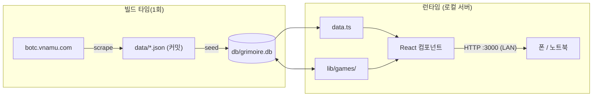

# BotC 그리모어 — DeepWiki

시계탑에 흐른 피(Blood on the Clocktower) 레퍼런스 + 로컬 디지털 그리모어.
코드를 처음 보는 사람이 전체 그림을 머릿속에 그리고, 어디를 고치면 무엇이 바뀌는지
알 수 있게 하는 것이 목표다. 실제 파일·데이터 흐름에 근거한다.

## 30초 멘탈 모델

1. **콘텐츠(직업·시트·규칙)는 읽기 전용 데이터.** vnamu에서 한 번 긁어 `data/*.json`으로
   박제 → 빌드 전 SQLite로 굽는다. 화면은 거의 정적.
2. **그리모어(게임 진행)는 가변 상태.** 핵심 아이디어: **정체성(누가·무슨 직업·어디 앉음)은
   게임 전역에 하나, 상태(생사·효과)는 페이즈마다 독립 스냅샷.**
3. **무슨 일이 있었나도 스냅샷에 기록.** 야간/낮 행동·주장·지목투표·악마 블러핑·메모를 페이즈별로
   남기고 복기에서 되본다. 정체성을 안 덮어써서 과거가 안 깨진다. 종료 게임은 통계로 집계
   ([/stats](../../app/stats/page.tsx)). 운영 보조로 게임 복제(같은 셋업·새 1일차 밤),
   전체화면 첩자 시점 + 그리모어 범례, 시트 단위 PNG 내보내기(직업 설명·밤 순서, A4)도 제공한다.
   → [09](09-storyteller-tools.md)
4. **노트북 한 대가 서버.** `0.0.0.0` 바인딩 → 같은 WiFi 폰이 접속(이야기꾼 보드 + 플레이어는
   자기 자리만 보는 폰 뷰). 인터넷 없이 LAN에서 동작.
5. **로그인·역할로 접근 분리.** 익명은 열람·복기, 로그인 유저는 본인 시트 CRUD, 이야기꾼·관리자만
   게임 시작·진행. 외부 의존성 없이 SQLite + crypto로 구현(통계는 가입 닉네임과 자동 연동).
   → [10](10-auth.md)

## 목차

| # | 문서 | 내용 |
|---|---|---|
| 01 | [개요와 스택](01-overview-and-stack.md) | 무엇을·왜, 기술 선택 이유, LAN 구동 |
| 02 | [데이터 파이프라인](02-data-pipeline.md) | 스크래핑 → JSON → SQLite, 데이터 모델 |
| 03 | [아키텍처](03-architecture.md) | 레이어 지도, 서버/클라 경계, 라우트 맵 |
| 04 | [그리모어 엔진](04-grimoire-engine.md) | **핵심.** 정체성↔스냅샷 분리, 페이즈, 마커, 라이프사이클, 마이그레이션 |
| 05 | [상태 동기화·렌더링](05-state-sync.md) | 액션→setGame, 시트 전체 전달 결정 |
| 06 | [준비 스텝과 비율](06-setup-and-ratio.md) | 게임 시작, 공식 인원 비율표 |
| 07 | [컴포넌트 레퍼런스](07-components.md) | 컴포넌트별 책임 |
| 08 | [설계 결정·확장·용어](08-decisions-and-extending.md) | 왜 이렇게? + 확장 가이드 + 용어집 |
| 09 | [이야기꾼 운영 도구](09-storyteller-tools.md) | 행동·보여주기·disguise·직업배포(claim)·타이머·undo·마커·투표·폰 뷰 |
| 10 | [인증·인가·권한](10-auth.md) | 로그인·세션·역할(관리자/이야기꾼/플레이어)·소유권·접근제어·통계 닉네임 동기화 |
| 11 | [온라인 플레이](11-online-play.md) | 룸·로비·초대·실시간(SSE)·진행/내역 분리·좌석 redaction 보안 |
| 12 | [커스텀 직업·동작 레지스트리](12-custom-characters.md) | 직업 동작의 데이터화(BASE/OVERLAY), 커스텀 직업 빌더, override, 이관 회귀 방어 |

> 코드 링크는 이 폴더(`docs/wiki/`) 기준 상대경로(`../../lib/...`)다.
